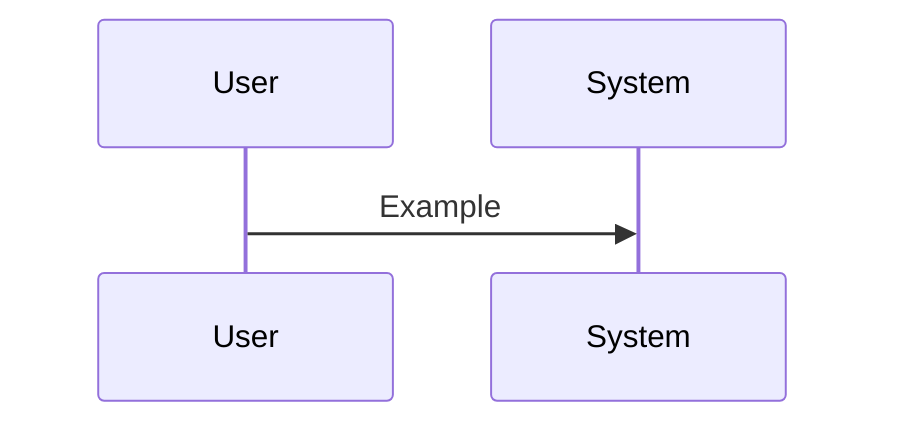

# Semi-Technical Walkthrough: <feature name>

> For stakeholders who read specs and contracts but not implementation diffs. No diagrams that expose secret internals unless already in `feature.plan.md`.

## Executive summary
- **Intent:** …
- **Scope:** …
- **Contracts touched:** …

## Spec & plan alignment
- Capabilities (C*) from `feature.spec.md` → plan sections / deliverables
- Open questions resolved vs deferred

## Architecture & data
- Entities added/changed (reference `data-model.md`)
- Sequence or flow summary (Mermaid optional):

## Contracts
| Contract | Change | Backward compatible? | Consumer impact |
|---|---|---|---|

## Impact forecast vs reality
- Predictions from `impact-forecast.md` that held
- Surprises / deltas and why

## Risks & follow-ups
- …

## Approval
- [ ] Semi-technical reviewer: <name>, <date>
- Comments:
