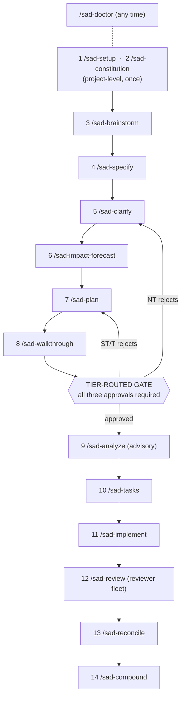

# SAD Cheatsheet — one page

## Command → artifact → approver

| # | Command | Artifact produced | Approver | Next command |
|---|---|---|---|---|
| 1 | `/sad-setup` | `.sad/`, `AGENTS.md` | — | `/sad-constitution` |
| 2 | `/sad-constitution` | `.sad/memory/constitution.md` | constitution amendment process | `/sad-brainstorm` |
| 3 | `/sad-brainstorm` | `requirements.draft.md` (optional) | feature owner | `/sad-specify` |
| 4 | `/sad-specify` | `feature.spec.md` | non-technical | `/sad-clarify` |
| 5 | `/sad-clarify` | revised `feature.spec.md` | non-technical | `/sad-impact-forecast` |
| 6 | `/sad-impact-forecast` | `impact-forecast.md` | semi-technical (advisory) | `/sad-plan` |
| 7 | `/sad-plan` | `feature.plan.md`, `data-model.md`, `contracts/` | semi-technical | `/sad-walkthrough` |
| 8 | `/sad-walkthrough` | three `walkthroughs/*.md` | **all three tiers** | `/sad-analyze` |
| 9 | `/sad-analyze` | findings (advisory) | — | `/sad-tasks` |
| 10 | `/sad-tasks` | `tasks.md` (waves, `[P]` markers) | — | `/sad-implement` |
| 11 | `/sad-implement` | code, tests | — | `/sad-review` |
| 12 | `/sad-review` | reviewer-fleet reports | technical | `/sad-reconcile` |
| 13 | `/sad-reconcile` | `reconciliation.md` (verdicts) | semi-technical | `/sad-compound` |
| 14 | `/sad-compound` | `.sad/memory/lessons/*.md` | — | (next feature) |

## Effort split (Compound Engineering default)

| Plan | Work | Review | Compound |
|---|---|---|---|
| **40 %** | 20 % | 20 % | 20 % |

The 80/20 inversion: most teams spend ~80 % of their time on Work and ~20 % on the surrounding ceremonies. SAD inverts that — 60 % is spec, plan, review, and compound; only 20 % is implementation. Source: Compound Engineering (Every Inc.) — see [`ATTRIBUTION.md`](ATTRIBUTION.md).

## The three tiers

| Tier | Reads | Approves | Examples |
|------|-------|----------|----------|
| **Non-Technical** | plain English, demos, EARS criteria | spec, non-tech walkthrough | business owner, domain expert, regulator, customer-success |
| **Semi-Technical** | plan, contracts, sequence diagrams | plan, semi-tech walkthrough, reconciliation | solution architect, PM, technical PM, designer, integration engineer |
| **Technical** | full PR, reviewer reports, evals | technical walkthrough, PR | senior eng, staff eng, security, tech lead |

## Maturity levels (who approves what)

| Level | Tier gates | Reviewer fleet | Auto-merge | Use when |
|-------|-----------|---------------|-----------|---------|
| **0 — Solo SAD** | one human ticks all three boxes; opt-in AI stand-in for missing tiers | optional | no | one human; OSS maintainer; weekend project |
| **1 — AI-Assisted Drafting** | all three human-approved | off | no | new to AI workflows; high-risk domain |
| **2 — AI-Augmented Review** | all three human-approved | on, reports → humans | no | AI fluency; trust still building |
| **3 — Autonomous within Approved Spec** | spec + walkthroughs only | on, gates auto-merge low-risk | yes (low-risk) | 6+ months SAD, calibrated evals |
| **4 — Autonomous + Periodic Reconciliation** | spec only; scheduled demos | on, continuous | yes | years of SAD, curated lessons |
| **5 — Outcome-Only Oversight** | outcomes only | on | yes | speculative |

## Common gotchas

- **Skipping the constitution** = SAD is just a folder structure.
- **"TBD" in stakeholder files** = tier gate cannot enforce.
- **Auto-approving everything to save time** = the gates *are* the methodology (spec theatre).
- **Choosing Level 3 because the team is senior** = maturity is about *SAD experience*, not generic AI fluency. Start lower.
- **"Don't modify unrelated code" rules silently suppressing `/sad-reconcile`** = reconciliation by design crosses adjacent files. Amend constitution or drop the rule.
- **Mass-generating specs for legacy code** = produces hundreds of artifacts nobody reads. Specify on-demand.
- **Treating walkthroughs as a single PR description** = the audience-tiered routing is the whole point.
- **Leaving rule policy duplicated** across `AGENTS.md`, the rule directory, and the constitution = the duplication is its own form of drift.

## Files you actually edit

| Path | When | Who |
|------|------|-----|
| `.sad/memory/constitution.md` | once at setup + on amendment | constitution amendment process |
| `.sad/stakeholders/*.md` | once at setup + when a tier reviewer changes | each tier's lead |
| `specs/<NNN>-<slug>/feature.spec.md` | per feature | non-technical drafts, AI assists |
| `specs/<NNN>-<slug>/feature.plan.md` | per feature | semi-technical drafts, AI assists |
| `specs/<NNN>-<slug>/walkthroughs/*.md` | per feature | AI drafts, each tier approves |
| `specs/<NNN>-<slug>/reconciliation.md` | per feature | AI detects, semi-technical approves verdicts |
| `.sad/memory/lessons/L-*.md` | post-feature | AI captures, no formal approval |

## Files you do **not** edit

`MANIFESTO.md`, `LIFECYCLE.md`, `ROLES.md`, `MATURITY.md`, `NOVEL.md`, `GLOSSARY.md`, `ATTRIBUTION.md`, `CHEATSHEET.md`, `QUICKSTART.md`, `SAD_USER_GUIDE.md`, anything under `.sad/templates/`. Fork or amend; do not edit canonically.
