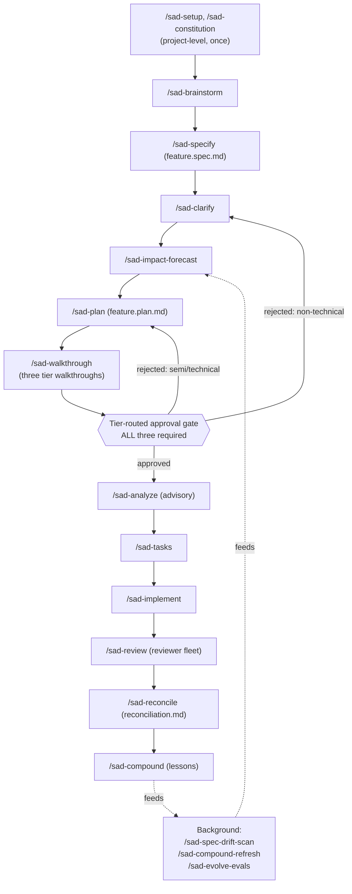
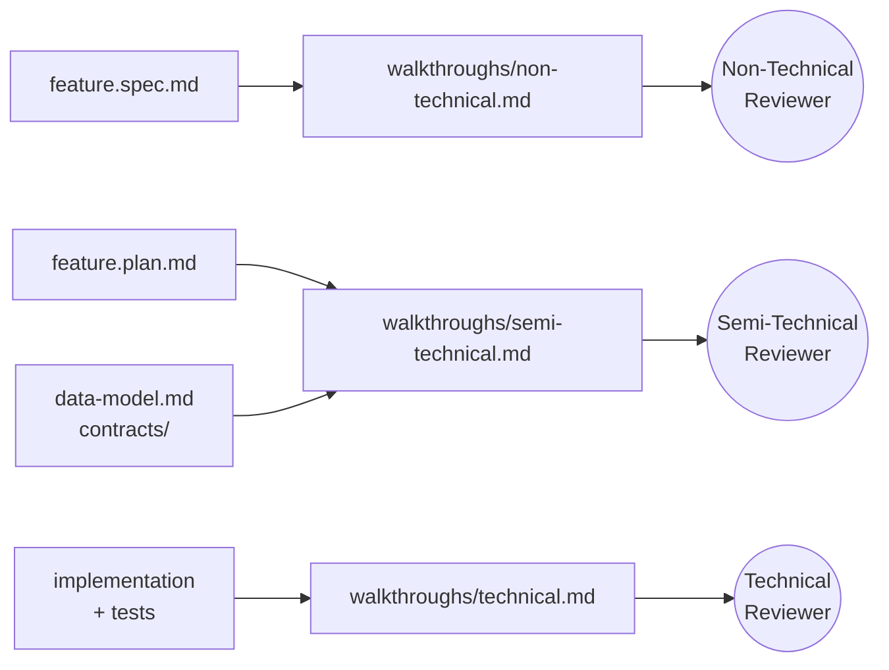
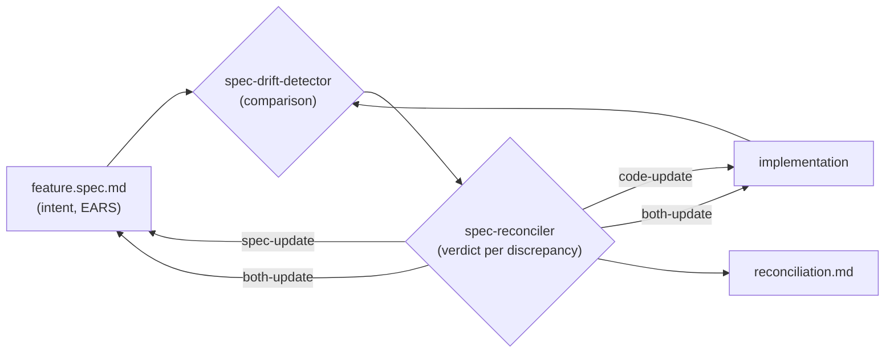
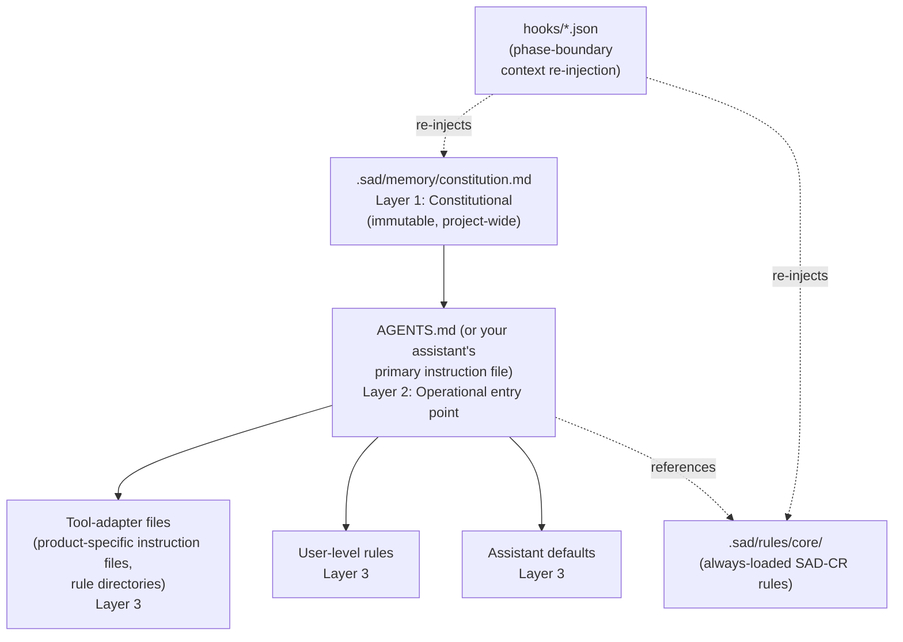

# SAD User Guide

> **A complete, self-contained introduction to Stakeholder-Anchored Development (SAD).** Start here if you have never used SAD before. This guide explains what the methodology is, why each piece exists, and how to install it in a new repository or fold it into one you already have. It is intentionally long and beginner-friendly; skim the headers if you want a fast tour, read straight through if you want depth.

---

## Table of contents

1. [Welcome and who this guide is for](#1-welcome-and-who-this-guide-is-for)
2. [What SAD is (and is not)](#2-what-sad-is-and-is-not)
3. [The five core mental models](#3-the-five-core-mental-models)
4. [System anatomy: every file in the SAD kit](#4-system-anatomy-every-file-in-the-sad-kit)
5. [The lifecycle in depth](#5-the-lifecycle-in-depth)
6. [Roles in practice](#6-roles-in-practice)
7. [The maturity ladder and how to pick your starting level](#7-the-maturity-ladder-and-how-to-pick-your-starting-level)
8. [Integrating SAD with an existing toolchain and rule system](#8-integrating-sad-with-an-existing-toolchain-and-rule-system)
9. [Onboarding path A: greenfield project](#9-onboarding-path-a-greenfield-project)
10. [Onboarding path B: existing (brownfield) project](#10-onboarding-path-b-existing-brownfield-project)
11. [A full worked feature, end to end](#11-a-full-worked-feature-end-to-end)
12. [Templates and artifacts reference](#12-templates-and-artifacts-reference)
13. [Hooks and agent-product wiring (deep dive)](#13-hooks-and-agent-product-wiring-deep-dive)
14. [Eval strategy](#14-eval-strategy)
15. [Compounding: lessons, refresh, drift-scan, rule-drift](#15-compounding-lessons-refresh-drift-scan-rule-drift)
16. [Common pitfalls and anti-patterns](#16-common-pitfalls-and-anti-patterns)
17. [Quick-reference cheatsheets](#17-quick-reference-cheatsheets)
18. [Where to go next](#18-where-to-go-next)

---

## 1. Welcome and who this guide is for

SAD (Stakeholder-Anchored Development) is a software-engineering methodology built around one observation: in an AI-augmented workflow, writing code is cheap and *getting the right code reviewed by the right people* is expensive. SAD optimizes for that constraint by making the *audience* of every artifact an explicit, first-class part of the process. There is not "the spec"; there are three spec-shaped artifacts, one for each of three named stakeholder audiences, each routed to its own reviewer, each blocking until approved.

This guide is for:

- **Engineers and tech leads** adopting SAD on a new or existing codebase. Read sections 1–10 first, then 11 for a worked example, then dip into the reference sections as you need them.
- **Product managers, technical PMs, solution architects, designers, integration engineers** — the *semi-technical* tier in SAD. You will mostly touch sections 1–3, 6, 7, 11, and 17.
- **Domain experts, regulatory officers, customer-success leads, end-user advocates** — the *non-technical* tier. Read sections 1, 2, 3 (especially the three-tier model), 6, and 11. You will be approving feature specs and demos, not editing them.
- **Anyone who has been told "we are switching to SAD"** and wants a tour. Read sections 1–4 to get oriented, then jump to your role's section.

SAD assumes you will be using one or more *AI coding assistants* — software that can read files, write files, run shell commands, and follow instructions from rule files in your repository. SAD does not care which assistant you use. It does care that the assistant respects the rule files this guide will show you how to set up.

> **Glossary.** When you see a term you do not recognise, check [GLOSSARY.md](GLOSSARY.md). Terms are linked to the glossary the first time they appear in this guide.

---

## 2. What SAD is (and is not)

### 2.1 What SAD is

SAD is an *operational synthesis*. It does not invent its primitives; it composes well-tested ideas from spec-driven development, compound engineering, AI-augmented development lifecycles, and enterprise-architecture governance into one coherent loop. Full provenance lives in [ATTRIBUTION.md](ATTRIBUTION.md); the genuinely new parts live in [NOVEL.md](NOVEL.md).

In one sentence: **SAD is a numbered lifecycle of plan-work-review-reconcile-compound, gated by tier-routed stakeholder approval, anchored on an immutable project constitution, and augmented by a parallel fleet of reviewer agents.**

In one diagram:



### 2.2 What SAD is not

SAD will not:

- **Replace your CI, build, or deploy systems.** It produces artifacts (specs, plans, walkthroughs, reconciliation reports) that sit alongside whatever you already have for testing and shipping.
- **Promise a velocity multiplier.** SAD is a discipline, not a productivity hack. If your team will not actually review the artifacts it produces, SAD becomes spec theatre.
- **Work without genuine stakeholder commitment of review time.** The three approval gates are the whole point. If you cannot get them, drop down a maturity level (see [section 7](#7-the-maturity-ladder-and-how-to-pick-your-starting-level)).
- **Eliminate engineering judgment.** The automated reviewer fleet catches a large fraction of issues; the rest requires humans who understand the system.

You can read the manifesto version of this in [MANIFESTO.md](MANIFESTO.md) under "What SAD Will Not Do".

---

## 3. The five core mental models

If you internalise nothing else, internalise these five ideas. Every command, file, and template in the kit is an expression of one of them.

### 3.1 Federated stakeholder authority

Centralising review with a single architect or product owner does not scale at AI-augmented velocity. Pure local autonomy produces drift and contract violations. SAD's answer is to *decentralise the decisions while centralising the rules*. The rules live in one immutable place (the constitution). The decisions live close to where the work is done (the per-feature tier reviewers). This is the "ground rules / natural compliance / build it together" pattern, applied per feature instead of per quarter.

Where to find it: [MANIFESTO.md](MANIFESTO.md) §"Three Pillars of Federated Stakeholder Authority"; the constitution template at [.sad/memory/constitution.md](.sad/memory/constitution.md).

### 3.2 The three-tier stakeholder model

This is SAD's distinctive structural dimension. Every feature produces three artifacts, written in three different registers, for three different audiences:

| Tier | Reads | Approves | Examples |
|------|-------|----------|----------|
| **Non-technical** | Plain-English narrative, demos, screenshot diffs, [EARS](GLOSSARY.md) acceptance criteria | The business spec and the non-technical walkthrough | Business owner, domain expert, regulatory officer, customer-success lead, end-user advocate |
| **Semi-technical** | Specs, plans, contract changes, sequence diagrams, structured PR summaries | The plan, the impact forecast, the reconciliation verdicts, the semi-technical walkthrough | Solution architect, product manager, technical PM, lead designer, integration engineer |
| **Technical** | The full PR, reviewer-fleet reports, eval results, technical walkthrough | The implementation | Senior or staff engineer, tech lead, security engineer |

The audience drives the artifact, not the other way around. The same feature is described three times because three different people, with three different vocabularies and risk frames, need to approve it.

Where to find it: [ROLES.md](ROLES.md); the three stakeholder definition files under [.sad/stakeholders/](.sad/stakeholders/); the three walkthrough templates under [.sad/templates/](.sad/templates/).



### 3.3 The 80/20 inversion

Default time allocation per feature is **40% planning, 20% implementing, 20% reviewing, 20% compounding lessons**. This inversion (most teams spend 70%+ implementing) is the answer to "when code is cheap, where does leverage live?" — in planning and review.

If your team's current allocation is closer to 10/80/10/0, expect SAD to feel slow at first. The speedup arrives later, through avoided rework and accumulated lessons.

Where to find it: [MANIFESTO.md](MANIFESTO.md) §"The 80/20 Inversion".

### 3.4 The bidirectional spec invariant

Specs are the *perpetual* artifact; code is a derivation. When the two disagree, you do not silently make code "the truth". You explicitly reconcile: either the spec was incomplete (update spec), the code drifted (fix code), or both diverged from a clearer intent (refactor both). This invariant is enforced by a numbered lifecycle phase — `/sad-reconcile` — that produces a `reconciliation.md` file with a verdict per discrepancy.



Where to find it: [LIFECYCLE.md](LIFECYCLE.md) §"Reconciliation (Step 13)"; the agents under [agents/reconciliation/](agents/reconciliation/).

### 3.5 The constitution as real-time decision support

The project constitution lives at [.sad/memory/constitution.md](.sad/memory/constitution.md). It is loaded into every phase as *real-time decision support*, not consulted after the fact for compliance. Its credibility depends on three things: it must be unambiguous, complete enough to cover the situations the project actually encounters, and short enough that an AI coding assistant can re-read it on every session start without burning the context budget.

The constitution names:

- The project's identity (name, primary users, risk class).
- The immutable principles (the things that are never traded away).
- The architecture boundaries (what is allowed, what requires a documented decision, what is forbidden).
- The evidence of done at each tier.
- The amendment process (who can change the constitution and how).
- An article index (numbered articles A1, A2, … that the automated [architectural-conformance reviewer](agents/reviewers/architectural-conformance.md) can score against).

Where to find it: the template at [.sad/memory/constitution.md](.sad/memory/constitution.md); the always-loaded summary at [.sad/rules/core/README.md](.sad/rules/core/README.md).

---

## 4. System anatomy: every file in the SAD kit

This section is your map. Each path below is annotated with what the file is, who edits it, and how often.

### 4.1 Top-level documents

| File | What it is | You edit it? |
|------|------------|--------------|
| [README.md](README.md) | One-paragraph orientation; pointers to other docs. | Rarely (once at fork time). |
| [SAD_USER_GUIDE.md](SAD_USER_GUIDE.md) | This guide. | Rarely. |
| [MANIFESTO.md](MANIFESTO.md) | Principles. The "why". | No (read-only reference). |
| [LIFECYCLE.md](LIFECYCLE.md) | The numbered loop. The "what happens when". | No. |
| [ROLES.md](ROLES.md) | The three human tiers and the agent personas. | No. |
| [MATURITY.md](MATURITY.md) | The five adoption levels. | No. |
| [GLOSSARY.md](GLOSSARY.md) | Term definitions. | Add terms as your domain grows. |
| [ATTRIBUTION.md](ATTRIBUTION.md) | Provenance of every primitive. | Add rows if you cite a new source. |
| [NOVEL.md](NOVEL.md) | What SAD genuinely contributes. | No. |
| [CONTRIBUTING.md](CONTRIBUTING.md) | How to propose changes to SAD itself. | No (unless contributing upstream). |
| [LICENSE](LICENSE) | MIT. | No. |
| [AGENTS.md](AGENTS.md) | Tells AI coding assistants how to navigate this methodology repo. *In a consuming project, you write your own `AGENTS.md` that points at your `.sad/memory/constitution.md`.* | Yes — once per consuming project. |

### 4.2 The `.sad/` directory

This is the live methodology state for *your* project. It is what you copy into a consuming repository.

```text
.sad/
├── memory/
│   ├── constitution.md         <- your project's immutable rules (you fill in)
│   └── lessons/                <- accumulated decisions and lessons (grows over time)
├── stakeholders/
│   ├── non-technical.md        <- who is the non-technical reviewer; how they review
│   ├── semi-technical.md       <- same for semi-technical
│   └── technical.md            <- same for technical
├── rules/
│   ├── core/README.md          <- always-loaded short rules (SAD-CR-001..004)
│   └── details/README.md       <- conditionally loaded topic rules (you add files)
├── templates/                  <- empty templates for every artifact (read-only)
├── scripts/                    <- helper shell scripts (read-only)
└── state/sad-state.md          <- live session-continuity marker
```

| Path | Purpose | Who edits |
|------|---------|-----------|
| [.sad/memory/constitution.md](.sad/memory/constitution.md) | Your project's identity, immutable principles, architecture boundaries, evidence-of-done definitions per tier, article index for conformance scoring. | Whoever the constitution's declared amendment process names (typically lead architect + product owner + security). |
| [.sad/memory/lessons/](.sad/memory/lessons/) | One file per decision-shaped lesson learned from a shipped feature. | Auto-populated by `/sad-compound`; pruned by `/sad-compound-refresh`. |
| [.sad/stakeholders/](.sad/stakeholders/) | One file per tier: who the people are, what they review, how they approve. | Edited at setup and whenever a tier's reviewer changes. |
| [.sad/rules/core/README.md](.sad/rules/core/README.md) | Four always-loaded short rules (SAD-CR-001 Constitution first, SAD-CR-002 Spec before code, SAD-CR-003 Tier-appropriate artifacts, SAD-CR-004 Evidence, not vibes). | Edited only if you adopt or repeal a core rule. |
| [.sad/rules/details/](.sad/rules/details/) | Topic-specific rule files loaded conditionally (e.g., one for API design, one for data migrations). | Edit when adding a domain. |
| [.sad/templates/](.sad/templates/) | One template per artifact type (spec, plan, impact forecast, three walkthroughs, tasks, reconciliation, story, lesson, demo reel). | Don't edit canonically — fork into your project if you need a custom layout. |
| [.sad/scripts/](.sad/scripts/) | `create-feature.sh`, `check-tier-approvals.sh`, `drift-scan.sh`, `update-state.sh`. | Don't edit — invoke. |
| [.sad/state/sad-state.md](.sad/state/sad-state.md) | The current active feature, phase, last command, blockers, next actions. Lets any agent resume mid-session. | Auto-updated by `update-state.sh` and by every long-running command. |

### 4.3 The `commands/` directory

One Markdown prompt per slash command. Each file is what an AI coding assistant reads when you invoke that command.

| Command file | Phase | When to run |
|--------------|-------|-------------|
| [commands/sad-setup.md](commands/sad-setup.md) | project-setup | Once, at repo bootstrap. |
| [commands/sad-constitution.md](commands/sad-constitution.md) | project-setup | Once, at repo bootstrap; again whenever you amend. |
| [commands/sad-brainstorm.md](commands/sad-brainstorm.md) | per-feature | When you have an idea but not yet a spec. |
| [commands/sad-specify.md](commands/sad-specify.md) | per-feature | After brainstorm; produces `feature.spec.md`. |
| [commands/sad-clarify.md](commands/sad-clarify.md) | per-feature | When the spec has open questions. |
| [commands/sad-impact-forecast.md](commands/sad-impact-forecast.md) | per-feature | After clarify, before plan. |
| [commands/sad-plan.md](commands/sad-plan.md) | per-feature | After impact forecast; produces `feature.plan.md`. |
| [commands/sad-walkthrough.md](commands/sad-walkthrough.md) | per-feature | After plan; produces all three tier walkthroughs. Blocks on three-tier approval. |
| [commands/sad-analyze.md](commands/sad-analyze.md) | per-feature | After walkthroughs; advisory consistency check. |
| [commands/sad-tasks.md](commands/sad-tasks.md) | per-feature | After approvals; produces `tasks.md`. |
| [commands/sad-implement.md](commands/sad-implement.md) | per-feature | After tasks; produces code. |
| [commands/sad-review.md](commands/sad-review.md) | per-feature | After implement; runs the reviewer fleet. |
| [commands/sad-reconcile.md](commands/sad-reconcile.md) | per-feature | After review; produces `reconciliation.md`. |
| [commands/sad-compound.md](commands/sad-compound.md) | per-feature | After reconcile; produces lesson files. |
| [commands/sad-demo.md](commands/sad-demo.md) | per-feature | Whenever the non-technical walkthrough needs visual evidence. |
| [commands/sad-stakeholder-report.md](commands/sad-stakeholder-report.md) | reporting | When packaging a tier-specific summary for distribution. |
| [commands/sad-spec-drift-scan.md](commands/sad-spec-drift-scan.md) | maintenance | Scheduled (daily or weekly). |
| [commands/sad-compound-refresh.md](commands/sad-compound-refresh.md) | maintenance | Scheduled (monthly). |
| [commands/sad-evolve-evals.md](commands/sad-evolve-evals.md) | maintenance | After an incident or repeated reviewer findings. |

### 4.4 The `agents/` directory

One Markdown persona per agent. Each is a prompt that an AI coding assistant adopts when dispatched as a sub-agent.

| Subdirectory | Contains | Invoked by |
|--------------|----------|------------|
| [agents/reviewers/](agents/reviewers/) | The parallel reviewer fleet: correctness, security, performance, simplicity, maintainability, testing, reliability, data integrity, architectural conformance, plus several others. | `/sad-review` |
| [agents/walkthrough-writers/](agents/walkthrough-writers/) | Three writers, one per tier. | `/sad-walkthrough` |
| [agents/reconciliation/](agents/reconciliation/) | `spec-drift-detector` and `spec-reconciler`. | `/sad-reconcile`, `/sad-spec-drift-scan` |
| [agents/research/](agents/research/) | `impact-forecaster`, `codebase-historian`, `git-history-analyzer`, `repo-research-analyst`, `lesson-curator`. | `/sad-impact-forecast`, `/sad-compound-refresh` |
| [agents/demo/](agents/demo/) | `demo-reel-recorder`, `screenshot-differ`, `scenario-narrator`. | `/sad-demo` |
| [agents/eval-graders/](agents/eval-graders/) | `eval-grader-deterministic`, `eval-grader-llm-judge`, `eval-grader-sme-calibrator`. | Your eval runner. |

### 4.5 The `hooks/` directory

Descriptive JSON hook files. They tell you *which events SAD wants to gate*; you map them to whatever event taxonomy your AI coding assistant supports.

| Hook file | What it gates | When it fires |
|-----------|---------------|---------------|
| [hooks/pre-spec.json](hooks/pre-spec.json) | Loads constitution + non-technical stakeholder context before any edit to `feature.spec.md`. | Before spec edits. |
| [hooks/post-spec.json](hooks/post-spec.json) | Suggests `/sad-clarify` if the spec has unresolved Open Questions. | After spec edits. |
| [hooks/pre-reconcile.json](hooks/pre-reconcile.json) | Asserts that `feature.spec.md` and any data-model / contracts files exist before `/sad-reconcile` runs. | Before reconcile. |
| [hooks/post-reconcile.json](hooks/post-reconcile.json) | Nudges semi-technical reviewer for sign-off and suggests `/sad-compound`. | After reconcile. |
| [hooks/stakeholder-tier-router.json](hooks/stakeholder-tier-router.json) | Blocks task generation until all three tier walkthrough approval checkboxes are checked. Uses [.sad/scripts/check-tier-approvals.sh](.sad/scripts/check-tier-approvals.sh). | Before `/sad-tasks`. |

### 4.6 The `evals/` directory

The eval-suite skeleton. You wire a runner of your choice (Python, TypeScript, your CI).

| Suite | Purpose |
|-------|---------|
| [evals/stakeholder/](evals/stakeholder/) | Tier-specific quality (narrative clarity, jargon violations, EARS coverage evidence). |
| [evals/spec-conformance/](evals/spec-conformance/) | Contracts, capabilities, acceptance criteria vs artifacts. |
| [evals/impl-correctness/](evals/impl-correctness/) | Behavioural correctness (often hidden tests). |
| [evals/architectural-conformance/](evals/architectural-conformance/) | SME-labelled calibration snippets for the `architectural-conformance` reviewer. |

### 4.7 The `examples/` directory

A worked feature you can read end-to-end before doing your own.

- [examples/001-hello-feature/](examples/001-hello-feature/) — a small feature ("user can save a personal greeting") with all artifacts populated.

### 4.8 The `specs/` directory (your project, not this repo)

Per-feature work goes here. The convention is `specs/<NNN>-<slug>/`:

```text
specs/001-my-feature/
├── feature.spec.md
├── feature.plan.md
├── impact-forecast.md
├── data-model.md            (optional)
├── contracts/               (optional)
├── tasks.md
├── walkthroughs/
│   ├── non-technical.md
│   ├── semi-technical.md
│   └── technical.md
├── demo/                    (gifs, screenshots, captures)
├── stories/                 (context capsules per task, optional)
├── evals/                   (per-feature eval cases)
└── reconciliation.md
```

This directory does *not* live inside `.sad/` — it lives at the project root. Your `.sad/` directory is the methodology; `specs/` is the work.

---

## 5. The lifecycle in depth

Read [LIFECYCLE.md](LIFECYCLE.md) for the canonical reference. Below is the same loop, slowed down, with the why of each step.

### 5.1 Project-level steps (run once)

#### Step 1 — `/sad-setup`

**Purpose.** Install SAD's structure in a target repository and bootstrap the entry-point instruction file at the repo root.

**Inputs.** The repository root, plus any existing instruction files you already have.

**Outputs.** `.sad/`, `commands/`, `agents/` confirmed present (or copied in); `specs/` directory created at repo root; the project's primary instruction file at the repo root (`AGENTS.md` is the standard cross-assistant filename) updated with pointers to [LIFECYCLE.md](LIFECYCLE.md), [MANIFESTO.md](MANIFESTO.md), and `.sad/memory/constitution.md`.

**Discipline.** Do not delete existing team instructions; merge SAD sections additively unless the user explicitly asked for replacement. Use relative paths portable across operating systems.

**You'll know this worked when** running `/sad-setup` produces a repo where the root `AGENTS.md` has a "SAD routing" section at or near the top and `.sad/` exists with constitution, stakeholders, rules, templates, scripts, and state subfolders.

#### Step 2 — `/sad-constitution`

**Purpose.** Author the project's constitution and tier definitions.

**Inputs.** Existing governance documents, ADRs, security policies, coding standards, anything that already constrains the project.

**Outputs.** A filled-in [.sad/memory/constitution.md](.sad/memory/constitution.md) with identity, immutable principles, architecture boundaries, evidence-of-done per tier, and a numbered article index; filled-in or refined files under [.sad/stakeholders/](.sad/stakeholders/) listing real names where known.

**Discipline.** Articles must be concrete enough that the [architectural-conformance reviewer](agents/reviewers/architectural-conformance.md) can score them. Flag tensions (speed vs safety, deliverable vs polish) explicitly — silent contradictions become drift.

**You'll know this worked when** the article index has at least three numbered articles and the three stakeholder files name actual people or placeholder roles, not "TBD".

### 5.2 Per-feature steps

#### Step 3 — `/sad-brainstorm`

**Purpose.** Right-size requirements before any spec is written.

**Inputs.** A feature idea or problem statement.

**Outputs.** Optionally `specs/<slug>/requirements.draft.md` — a short informal capture of user, problem, success signal, out-of-scope hints, regulatory or privacy constraints, and rough size (S/M/L).

**Discipline.** Do not write the spec yet. Capture assumptions explicitly; the impact forecaster will need them.

#### Step 4 — `/sad-specify`

**Purpose.** Produce `feature.spec.md` — the non-technical-tier artifact.

**Inputs.** The brainstorm draft (if any), plus the [.sad/templates/feature.spec.md](.sad/templates/feature.spec.md) template.

**Outputs.** `specs/<slug>/feature.spec.md` with: business intent (one paragraph, plain English), capabilities (C1, C2, … each linked to acceptance criteria), [EARS](GLOSSARY.md)-notation acceptance criteria, explicit out-of-scope items, stakeholder commitments, and any open questions.

**Discipline.** No implementation detail. Every acceptance line is testable or demoable in plain language.

**Gate.** Non-technical reviewer approves (a checked Markdown checkbox in the file, or an external acceptance reference like a ticket link).

#### Step 5 — `/sad-clarify`

**Purpose.** Resolve ambiguities and iterate the spec.

**Inputs.** `feature.spec.md` with open questions.

**Outputs.** The same file with each open question either resolved into Business Intent / Acceptance, or tagged with a **Decision needed:** block listing options and a recommendation.

**Discipline.** Prefer edits inside the spec over chat prose. Maintain traceability — moved-resolved questions should leave a fingerprint in the section they were promoted into.

#### Step 6 — `/sad-impact-forecast`

**Purpose.** Predict downstream effects *before* planning starts. SAD's pre-plan primitive.

**Inputs.** `feature.spec.md`; [.sad/memory/lessons/](.sad/memory/lessons/) recursively; every existing `specs/*/feature.spec.md`; the most recent `specs/*/reconciliation.md` for any feature whose capabilities overlap.

**Outputs.** `specs/<slug>/impact-forecast.md` with sections for predicted effects on stakeholder commitments, contracts, capabilities, performance and security envelopes, and lesson applicability. Each row has a severity (1–5) with rationale.

**Discipline.** Be specific. "May affect performance" is useless; "Likely to add 30–60 ms p95 to the auth endpoint based on lesson L-2025-014" is useful. Cross-reference every prediction to the artifact you consulted.

**Gate.** Semi-technical reviewer reviews (advisory — informational, does not block).

#### Step 7 — `/sad-plan`

**Purpose.** Produce `feature.plan.md` — the semi-technical-tier artifact — plus data-model and contract files as needed.

**Inputs.** The approved spec and the impact forecast.

**Outputs.** `feature.plan.md` with scope mapping (capability → deliverable), design (key flows, data model touchpoints, contracts), dependencies, risks (from the forecast), and verification strategy at the semi-technical level.

**Discipline.** No task-level granularity (that is `/sad-tasks`). Flag any constitution violations early.

**Gate.** Semi-technical reviewer approves.

#### Step 8 — `/sad-walkthrough` (the tier-routed approval gate)

**Purpose.** Generate three tier-specific walkthroughs in parallel and block on all three approvals.

**Inputs.** The approved spec, the approved plan, and the impact forecast.

**Outputs.**

- `specs/<slug>/walkthroughs/non-technical.md` — scenario narrative, demo references, EARS coverage table; no code, no file paths.
- `specs/<slug>/walkthroughs/semi-technical.md` — spec/plan/contracts summary, contract delta table, sequence diagrams; no implementation line-level detail.
- `specs/<slug>/walkthroughs/technical.md` — PR-level summary, reviewer-fleet rollup, eval results; full fidelity.

**Discipline.** The non-technical writer uses step-decomposition with alternatives-per-decision (for each decision the system makes: alternatives considered, choice made, why). The semi-technical writer compares the impact forecast's predictions to the planned implementation. The technical writer flags any deviations from `feature.plan.md`.

**Gate (the most important gate in SAD).** All three approval checkboxes must be checked. If non-technical rejects, return to `/sad-clarify`. If semi-technical or technical rejects, return to `/sad-plan` with annotated feedback. Enforced mechanically by [.sad/scripts/check-tier-approvals.sh](.sad/scripts/check-tier-approvals.sh).

#### Step 9 — `/sad-analyze`

**Purpose.** Read-only consistency check of spec + plan + tasks against the constitution.

**Inputs.** Spec, plan, tasks (if any), constitution.

**Outputs.** A findings table with severities and recommended next commands. Optionally persisted to `specs/<slug>/analysis.md` if your team wants a record.

**Discipline.** This phase does not modify source files. It is advisory.

#### Step 10 — `/sad-tasks`

**Purpose.** Expand the plan into `tasks.md` with wave-based ordering and `[P]` parallel-safe markers.

**Inputs.** `feature.plan.md`.

**Outputs.** `tasks.md` with waves (sequential between waves, parallel within), each task citing the capability (C*) it satisfies where non-obvious.

**Discipline.** `[P]` is only for tasks that are order-independent and touch disjoint files. The `stakeholder-tier-router` hook should block this command until all three tier approvals are checked.

#### Step 11 — `/sad-implement`

**Purpose.** Execute tasks, wave by wave.

**Inputs.** `tasks.md`, the spec, the plan, and the story files under [stories/](.sad/templates/story.md) for context firewalling when parallelising.

**Outputs.** Code, tests, updated demo assets.

**Discipline.** If implementation requires a spec change, *pause* and route through `/sad-clarify` or `/sad-specify`. This is the bidirectional spec invariant in action. Check off tasks honestly — do not mark tasks complete to look productive.

#### Step 12 — `/sad-review`

**Purpose.** Run the parallel reviewer fleet against the change-set.

**Inputs.** The diff or PR or branch state, plus the personas under [agents/reviewers/](agents/reviewers/).

**Outputs.** Structured reviewer reports per reviewer (correctness, security, performance, simplicity, maintainability, testing, reliability, data integrity, architectural conformance, and any others your project enables). Summarised in `walkthroughs/technical.md`.

**Discipline.** Each reviewer references constitution articles where applicable, includes confidence and severity, and avoids performative unanimity.

**Gate.** Technical reviewer signs off on the rolled-up findings.

#### Step 13 — `/sad-reconcile`

**Purpose.** Close the spec-code loop. Detect drift; classify and propose verdicts.

**Inputs.** The spec, the data model, the contracts, the implementation source files.

**Outputs.** `specs/<slug>/reconciliation.md` with a per-discrepancy table: location (file:line) in both spec and code, description, proposed verdict (`spec-update` / `code-update` / `both-update`), confidence, one-line rationale. Highlights blocking items at the top.

**Discipline.** Detection first — do not silently edit code in this phase unless the user explicitly enabled auto-fix in their toolchain. Every discrepancy must close as one of the three verdicts; ambiguous verdicts are not allowed.

**Gate.** Semi-technical reviewer approves the verdicts before merge.

#### Step 14 — `/sad-compound`

**Purpose.** Capture durable lessons from the shipped feature.

**Inputs.** Completed `tasks.md`, the reconciliation report, the PR, and the constitution.

**Outputs.** One or more lesson files under [.sad/memory/lessons/](.sad/memory/lessons/), using the [.sad/templates/lesson.md](.sad/templates/lesson.md) format (Decision + Lesson + Links). Optionally incremental updates to the primary instruction file at the repo root if a lesson is project-global.

**Discipline.** Lessons are specific and actionable, not generic advice. Extend an existing lesson file rather than duplicating if the same decision surface is involved.

### 5.3 Background maintenance steps

These run on a schedule (your CI, your cron, or your team's calendar).

| Command | Cadence | Purpose |
|---------|---------|---------|
| [/sad-spec-drift-scan](commands/sad-spec-drift-scan.md) | Daily or weekly | Lower-fidelity sweep across all features for missing reconciliation, drifted contracts, or missing artifacts. |
| [/sad-compound-refresh](commands/sad-compound-refresh.md) | Monthly | Prune superseded lessons; archive them with a reason header; summarise the active set into a digest. *Extend this to also diff each instruction file against the constitution* — see [section 8](#8-integrating-sad-with-an-existing-toolchain-and-rule-system) pattern 5. |
| [/sad-evolve-evals](commands/sad-evolve-evals.md) | After incidents or repeated findings | Promote failing prompts or missing assertions into deterministic or LLM-judge eval cases. |

---

## 6. Roles in practice

### 6.1 Non-technical reviewer

**Who they are.** Business owner, domain expert, regulatory officer, customer-success lead, end-user advocate. They have deep knowledge of the *problem*; they typically cannot read code.

**What they review.** `feature.spec.md` (business intent + EARS criteria), `walkthroughs/non-technical.md` (scenario narrative), the `demo/` folder.

**What they do not review.** `feature.plan.md`, `tasks.md`, code, contracts, sequence diagrams. SAD explicitly *protects* them from these artifacts. Research shows non-programmers systematically miss critical flaws in AI-generated code even when primed to look (see Virk & Liu, arXiv 2508.06484), so the non-technical walkthrough is engineered to elicit *intent and scenario* feedback, not technical correctness feedback.

**How they approve.** A signed-off Markdown checkbox in the walkthrough file, or an external acceptance reference (a ticket link, a signed PDF, meeting-note approval).

**How to set them up.** Edit [.sad/stakeholders/non-technical.md](.sad/stakeholders/non-technical.md) with real names, communication preferences (async vs synchronous, cadence, format), and what "approved" means in your context.

### 6.2 Semi-technical reviewer

**Who they are.** Solution architects, product managers, technical PMs, lead designers, integration engineers. They read specs and contracts but do not implement.

**What they review.** `feature.spec.md`, `feature.plan.md`, `data-model.md`, `contracts/`, sequence diagrams, `walkthroughs/semi-technical.md`, `impact-forecast.md`, `reconciliation.md` verdicts.

**What they do not review.** Implementation diffs at the line level. They attest that *intent + integration risk + reconciliation* are coherent.

**How they approve.** Checkbox in `walkthroughs/semi-technical.md` for the walkthrough; a separate sign-off on `reconciliation.md` before merge.

**How to set them up.** Edit [.sad/stakeholders/semi-technical.md](.sad/stakeholders/semi-technical.md) with real names and the structured-summary formats they prefer.

### 6.3 Technical reviewer

**Who they are.** Senior engineers, staff engineers, security champions, tech leads.

**What they review.** The full PR, the rolled-up reviewer-fleet output, `walkthroughs/technical.md`, the eval-suite results.

**What they do not delegate.** The final merge decision for high-risk changes (per the maturity level). Override of constitution violations without an explicit amendment.

**How they approve.** Checkbox in `walkthroughs/technical.md`; PR approval in version control.

**How to set them up.** Edit [.sad/stakeholders/technical.md](.sad/stakeholders/technical.md) with real names and review-cadence expectations.

### 6.4 The agent personas (quick reference)

You will rarely edit these — they are read by your AI coding assistant when SAD commands invoke sub-agents.

| Persona file | When invoked | What it does |
|--------------|--------------|--------------|
| [agents/reviewers/correctness.md](agents/reviewers/correctness.md) | `/sad-review` | Verifies logic and acceptance-criteria coverage. |
| [agents/reviewers/security.md](agents/reviewers/security.md), [security-sentinel.md](agents/reviewers/security-sentinel.md) | `/sad-review` | Threat modelling, authorization checks. |
| [agents/reviewers/performance.md](agents/reviewers/performance.md), [reliability.md](agents/reviewers/reliability.md) | `/sad-review` | Latency, throughput, failure modes. |
| [agents/reviewers/maintainability.md](agents/reviewers/maintainability.md), [simplicity.md](agents/reviewers/simplicity.md) | `/sad-review` | Readability, complexity. |
| [agents/reviewers/testing.md](agents/reviewers/testing.md) | `/sad-review` | Test coverage and quality. |
| [agents/reviewers/data-integrity.md](agents/reviewers/data-integrity.md), [data-migrations.md](agents/reviewers/data-migrations.md), [schema-drift-detector.md](agents/reviewers/schema-drift-detector.md) | `/sad-review` | Data lifecycle. |
| [agents/reviewers/architectural-conformance.md](agents/reviewers/architectural-conformance.md) | `/sad-review` | Scores against each constitution article using a rubric calibrated by SME-labelled examples. |
| [agents/reviewers/api-contract.md](agents/reviewers/api-contract.md), [pattern-recognition.md](agents/reviewers/pattern-recognition.md), [architecture-strategist.md](agents/reviewers/architecture-strategist.md) | `/sad-review` | Contract drift, design patterns. |
| [agents/reviewers/adversarial.md](agents/reviewers/adversarial.md) | `/sad-review` | Red-team thinking. |
| [agents/reviewers/project-standards.md](agents/reviewers/project-standards.md) | `/sad-review` | Compliance with the project's instruction files. |
| [agents/reviewers/deployment-verification.md](agents/reviewers/deployment-verification.md) | `/sad-review` | Pre-merge deploy checks. |
| [agents/walkthrough-writers/*.md](agents/walkthrough-writers/) | `/sad-walkthrough` | Three writers, one per tier. |
| [agents/reconciliation/spec-drift-detector.md](agents/reconciliation/spec-drift-detector.md) | `/sad-reconcile`, `/sad-spec-drift-scan` | Detects drift; proposes per-discrepancy verdicts. |
| [agents/reconciliation/spec-reconciler.md](agents/reconciliation/spec-reconciler.md) | `/sad-reconcile` | Deduplicates findings; classifies blocking vs non-blocking. |
| [agents/research/impact-forecaster.md](agents/research/impact-forecaster.md) | `/sad-impact-forecast` | Consults lessons + spec registry + reconciliations. |
| [agents/research/codebase-historian.md](agents/research/codebase-historian.md), [git-history-analyzer.md](agents/research/git-history-analyzer.md), [repo-research-analyst.md](agents/research/repo-research-analyst.md) | Optional | Background research. |
| [agents/research/lesson-curator.md](agents/research/lesson-curator.md) | `/sad-compound-refresh` | Prunes stale lessons. |
| [agents/demo/*.md](agents/demo/) | `/sad-demo` | Generate GIFs, screenshot diffs, narrated scenarios. |
| [agents/eval-graders/*.md](agents/eval-graders/) | Your eval runner | Deterministic, LLM-judge, or SME-calibrator grading. |

---

## 7. The maturity ladder and how to pick your starting level

Read [MATURITY.md](MATURITY.md) for the canonical descriptions; below is the practical version.

### 7.1 The five levels, in plain language

| Level | What humans approve | What AI does |
|-------|---------------------|--------------|
| **1 — AI-Assisted Drafting** | Every gate, every artifact. | Drafts specs and plans. No reviewer fleet runs. |
| **2 — AI-Augmented Review** | Every tier-routed gate. | Drafts artifacts; the reviewer fleet emits reports for human approval. |
| **3 — AI-Autonomous Within Approved Spec** | Spec and walkthroughs only. | Runs `/sad-tasks` through `/sad-review` autonomously. Low-risk diffs auto-merge based on reviewer-fleet confidence scores; high-risk diffs still need a human. |
| **4 — AI-Autonomous With Periodic Stakeholder Reconciliation** | The spec; scheduled demos. | Runs the whole loop including walkthrough generation. Drift-scan runs continuously. |
| **5 — Fully Autonomous With Outcome-Only Oversight** | Outcome metrics and serious deviations only. | Everything else. (Speculative.) |

### 7.2 How to pick

Answer these four questions; the highest "no" wins.

1. *Has the team operated SAD at the proposed level for 4+ weeks of green eval suites?* If not, drop one level.
2. *Is the reviewer-fleet false-positive rate below 10% in the proposed level?* If not, drop.
3. *Are stakeholder satisfaction surveys above 80% per tier?* If not, drop.
4. *Have you had fewer than one rollback per 20 features at the proposed level?* If not, drop.

If you cannot answer because you have no data, **start at Level 1**. There is no shame in Level 1; many teams stay there permanently because the domain is high-risk (medical, safety-critical, regulated financial).

### 7.3 Documenting your level

Add a line to your constitution under "Identity":

> **Maturity level (initial):** Level 2. Target for next quarter: Level 3 conditional on the four graduation criteria above.

That single line drives a lot. It tells your reviewer fleet which gates require humans, tells your hooks whether to auto-pass low-risk diffs, and tells stakeholders what to expect.

---

## 8. Integrating SAD with an existing toolchain and rule system

This is the section most readers come back to. It answers "how do I prevent the methodology from being drowned out by my project's other rules?".

### 8.1 The many-rule problem

A realistic project typically loads several instruction sources at once:

- A **primary instruction file** at the repo root (a cross-assistant standard name) that the AI coding assistant reads first.
- One or more **assistant-specific instruction files** with their own conventional names.
- A **rule directory** — files that are either always loaded or loaded conditionally by glob (for instance, "load this rule when editing files matching `**/api/**`").
- Optional **skill, command, or preset files** that wrap reusable workflows.
- Optional **hook / event / lifecycle files** that fire on assistant events (before tool calls, after tool calls, session start, session stop, and so on).
- **User-level rule files** outside the repository that the assistant injects regardless of project.
- Optional **external knowledge bases or wikis** that the assistant consults for cross-project memory.
- The **assistant's built-in defaults** baked into its system prompt.

These sources compete for the assistant's limited context budget. They frequently say different things. Without a declared precedence, SAD's discipline can be silently overridden by the loudest or most recent rule the assistant has loaded.

### 8.2 The three-layer authority model

SAD prescribes a three-layer model. Every rule the project enforces lives in exactly one layer.



- **Layer 1 — Constitutional.** [.sad/memory/constitution.md](.sad/memory/constitution.md) is the unbreakable source of truth for what the project will and will not do. Every other rule source defers to it.
- **Layer 2 — Operational entry point.** The repository's primary instruction file (typically `AGENTS.md` at the repo root). Deliberately short — under 30 lines is the target. Its first job is to point at the constitution, at [LIFECYCLE.md](LIFECYCLE.md), and at [.sad/rules/core/README.md](.sad/rules/core/README.md) (the four always-loaded SAD-CR rules).
- **Layer 3 — Tool adapter.** Any assistant-specific instruction file, any rule directory, any user-level rule file. Contains *only* tool-mechanical guidance — operating-system quirks, preferred local tools (e.g., "use the editor's Read tool instead of `cat`"), shell choice, formatter command, environment-variable conventions. Project policy is *not* restated here; project policy lives in Layer 1.

### 8.3 Declared precedence

Write this verbatim at the top of your repo's primary instruction file:

```markdown
## Rule precedence

When two rules conflict, the higher layer wins.

1. .sad/memory/constitution.md  (immutable project policy)
2. THIS FILE                    (operational entry point)
3. tool-adapter files           (per-assistant mechanical guidance)
4. user-level rule files        (personal preferences)
5. assistant defaults

If you detect a conflict, surface it. Do not silently follow a lower-layer rule that contradicts the constitution.
```

This is the single most important paragraph SAD asks you to add to your repo. It prevents silent override.

### 8.4 Six methodology-preservation patterns

| # | Pattern | What it means | Where it lives |
|---|---------|---------------|----------------|
| 1 | **Single-anchor** | Exactly one file at the repo root is the "first-read" entry point. Every other instruction source points to it. | Your repo root `AGENTS.md`. |
| 2 | **Loadable-summary** | A handful of very short always-loaded rules so even minimal-context sessions retain SAD discipline. | [.sad/rules/core/README.md](.sad/rules/core/README.md) (the four SAD-CR rules). |
| 3 | **Thin-pointer** | Tool-adapter files stay around 10–20 lines. They route to canonical sources, they do not restate policy. | Whatever your assistant calls its instruction file. |
| 4 | **Hook-injected reminders** | At phase boundaries the constitution and tier rules are re-injected so they are not evicted from context during long sessions. | [hooks/pre-spec.json](hooks/pre-spec.json), [hooks/pre-reconcile.json](hooks/pre-reconcile.json). |
| 5 | **Rule-drift sweep** | `/sad-compound-refresh` also diffs each instruction file against the constitution; unjustified divergence is itself drift. | Extend [commands/sad-compound-refresh.md](commands/sad-compound-refresh.md) with a rule-diff step. |
| 6 | **Constitution amendment ceremony** | The only legitimate way for a tool-file or team-rule to override SAD discipline is to amend the constitution. Silent overrides are forbidden. | [.sad/memory/constitution.md](.sad/memory/constitution.md) "Stakeholder Approval" section names the amendment process. |

### 8.5 The four-step conflict-resolution protocol

When you bring SAD into a repo that already has rules, you will encounter conflicts. Resolve them like this.

#### Step 1 — Rule audit

Use this checklist. Cross off each item with the file path you found.

- [ ] Primary repo-root instruction file (a cross-assistant convention).
- [ ] Any assistant-specific instruction files alongside the primary one.
- [ ] Rule-directory files (always-on or glob-scoped).
- [ ] Skill / command / preset files.
- [ ] Hook / event / lifecycle files.
- [ ] User-level rule files (in the user's home directory) that affect this project.
- [ ] External knowledge-base configuration that injects content into the assistant.
- [ ] Any `README.md` sections at the repo root that double as agent instructions.
- [ ] Any committed agent-state files (session continuity, memory markers).

#### Step 2 — Classify each rule

Read each rule in each file and put it in one bucket.

| Bucket | Definition | Example |
|--------|------------|---------|
| **Constitutional** | Governs *what the project does or will not do*. | "All persisted data is encrypted at rest." |
| **Tool-mechanical** | Assistant-specific quirk. Same project policy would apply with any assistant. | "On this operating system the Python executable is named `python`." |
| **Style/quality** | Code style, lint config, testing threshold. | "Line length 100 characters." |
| **Workflow** | Process, ceremony, or routing. | "Hotfixes skip spec review." |

#### Step 3 — Migrate

- *Constitutional* rules move into [.sad/memory/constitution.md](.sad/memory/constitution.md) as numbered articles. The constitution's article index gets a row per rule; the reviewer fleet's architectural-conformance grader scores against each.
- *Style/quality* rules either become constitution articles (if they are non-negotiable for the project) or remain in their existing config (formatter config, lint config). Do not duplicate them in both.
- *Tool-mechanical* rules stay in the tool-adapter file. They are correctly Layer 3.
- *Workflow* rules go through Step 4.

#### Step 4 — Resolve workflow conflicts explicitly

When a pre-existing workflow rule contradicts SAD discipline, you have exactly two paths.

- **Path A — Amend the constitution.** Propose an article that legitimises the existing workflow. The classic example: "hotfixes for severity-1 incidents may bypass `/sad-walkthrough` provided that a post-mortem `/sad-reconcile` runs within 48 hours and produces a non-empty reconciliation.md." Now the workflow is no longer a conflict; it is a documented exception with declared conditions.
- **Path B — Let SAD's precedence apply.** Drop the conflicting rule. Document the deletion in `/sad-compound` as a lesson so the team remembers why.

What you cannot do: silently obey the lower-layer rule. That is how methodologies die.

### 8.6 Six generic integration patterns

Below are six integration patterns, classified by *what your AI coding assistant supports*, not by which assistant you use. If your assistant supports a capability, use the matching pattern.

#### Pattern A — Assistant with a primary instruction file at the repo root

This is the most common shape. The primary instruction file (the cross-assistant standard name is `AGENTS.md`) is the Layer 2 operational entry point.

**Setup:**

1. Run `/sad-setup`. It will create or merge `AGENTS.md` at the repo root.
2. The file's structure should be:
   - The declared-precedence block from [section 8.3](#83-declared-precedence) (at the top).
   - A two-line pointer to [.sad/memory/constitution.md](.sad/memory/constitution.md) ("Project policy lives in the constitution. Read it before any phase that touches policy.").
   - A two-line pointer to [LIFECYCLE.md](LIFECYCLE.md) ("Workflow lives in LIFECYCLE.md.").
   - A two-line pointer to [.sad/rules/core/README.md](.sad/rules/core/README.md) ("Always-loaded short rules.").
   - Anything else the team needs to put here is mechanical only; if it is policy, move it to the constitution.
3. **You'll know this worked when** an AI coding assistant opening the repo fresh quotes SAD-CR-001 in its first response, and follows the precedence rule when asked about a conflict.

#### Pattern B — Assistant with a rule directory

Some assistants load rule files from a directory; some are always on, some are glob-scoped to file types.

**Setup:**

1. Add exactly one short routing rule to that directory. Mark it always-on. Its content:

   ```markdown
   # SAD routing

   This project follows the SAD methodology. The single source of truth for project policy is .sad/memory/constitution.md. The single operational entry point is the repo's primary instruction file (AGENTS.md at the repo root). All other rule files, including this one, are Layer 3 (tool-mechanical only).

   When a project-policy question arises, read .sad/memory/constitution.md and .sad/rules/core/README.md before answering.

   Precedence: constitution > AGENTS.md > tool-adapter files > user rules > assistant defaults.
   ```

2. Anything else in the rule directory must be tool-mechanical (not policy).
3. **You'll know this worked when** the rule directory has at most one short routing rule plus tool-mechanical files; any policy that was duplicated there has been migrated to the constitution.

#### Pattern C — Assistant with hooks / events / lifecycle scripts

Some assistants fire events at well-known points (before a tool call, after a tool call, when a session starts, when a session ends).

**Setup:**

1. Read [hooks/README.md](hooks/README.md). The hook JSON files there are *descriptive*; you map them to your assistant's event names.
2. Use this generic translation table:

   | SAD hook | Generic event class | Typical event name in assistants |
   |----------|---------------------|----------------------------------|
   | `pre-spec.json` | Before-tool-use, matched on `feature.spec.md` writes | `PreToolUse`, `before-edit`, `on-pre-write` |
   | `post-spec.json` | After-tool-use, matched on `feature.spec.md` writes | `PostToolUse`, `after-edit`, `on-post-write` |
   | `pre-reconcile.json` | Before-tool-use, matched on `reconciliation.md` writes or `/sad-reconcile` invocations | `PreToolUse` |
   | `post-reconcile.json` | After-tool-use, matched on `reconciliation.md` writes | `PostToolUse` |
   | `stakeholder-tier-router.json` | Before-tool-use, matched on `tasks.md` writes or `/sad-tasks` invocations | `PreToolUse` |

3. Wire `stakeholder-tier-router.json` first; it is the highest-leverage hook. It blocks `tasks.md` writes until all three tier walkthroughs are approved, by running [.sad/scripts/check-tier-approvals.sh](.sad/scripts/check-tier-approvals.sh).
4. **You'll know this worked when** attempting to write `tasks.md` for a feature whose walkthrough approval boxes are not all checked produces a denial with a message naming the missing tier.

#### Pattern D — Assistant with reusable skill / command / preset files

Some assistants let you register reusable workflows as named skills, commands, or presets that the user can pick from a menu.

**Setup:**

1. For each `commands/sad-*.md` file, register a corresponding skill/command/preset in your assistant's native format. The skill file's body is short and refers to the canonical prompt under [commands/](commands/).
2. Keep the canonical prompt under `commands/` as the source of truth. Your assistant's skill registration is a *pointer*, not a copy.
3. **You'll know this worked when** the SAD commands appear in your assistant's skill picker by name and invoking one reads the canonical prompt file.

#### Pattern E — External long-term knowledge base or wiki

Some teams maintain a cross-project knowledge base (a wiki, a graph database, a shared notebook system). SAD's lesson store is *intra-project* memory. The integration is bidirectional but asymmetric.

- **Outbound (one-way sync).** On `/sad-compound`, mirror the lesson into the external knowledge base as a project page. The external store is *informed* by SAD; it does not own the canonical lesson. If the lesson is later archived in `.sad/memory/lessons/_archive/` by `/sad-compound-refresh`, the external mirror is updated to mark it superseded.
- **Inbound (advisory query).** During `/sad-impact-forecast`, optionally query the external knowledge base for cross-project precedents. The query result is *advisory*, never authoritative. The constitution remains the single source of truth for the project.

**Setup:**

1. Decide whether you want both directions, only outbound, or only inbound. Outbound-only is the safer starting choice.
2. Implement the sync as part of `/sad-compound` (or wire it as a `post-compound` hook).
3. **You'll know this worked when** a freshly written lesson appears in the external knowledge base as a project page within the team's expected propagation time, and the project page links back to the canonical lesson file under `.sad/memory/lessons/`.

> **Warning.** Never let the external knowledge base become authoritative over the constitution. The flow is *from* SAD *to* the external store, not the other way around. If your team is tempted to let the external store originate policy, that policy needs to live in the constitution.

#### Pattern F — Multiple AI coding assistants on one repo

A repo might have two or three assistants used by different team members. The single-anchor and declared-precedence patterns are sufficient; no per-assistant forking of rules is needed.

**Setup:**

1. Ensure the primary instruction file (`AGENTS.md`) is the only "first-read" file. Patterns A, B, C, D may each apply to one or more of the assistants in use; they remain compatible because they each defer to Layer 1 and Layer 2.
2. Tool-adapter files for different assistants live side-by-side at Layer 3. They contain only mechanical guidance.
3. **You'll know this worked when** every assistant on the project, regardless of vendor, can answer "what is the rule precedence?" identically by reading the top of `AGENTS.md`.

### 8.7 Anonymised worked migration

A hypothetical brownfield repository arrives with:

- A sizeable existing primary instruction file mixing operating-system quirks, token-discipline guidance, an iterative quality loop, a default code-style policy, and a workflow note "do not modify unrelated code".
- A rule directory with five files overlapping each other.
- A user-level rule file with the developer's personal style preferences.
- A reference to an external knowledge base.
- No constitution, no specs directory.

**Audit (step 1).** Eight rule sources found. Listed in a table:

| # | Source | Layer guess |
|---|--------|-------------|
| 1 | Primary instruction file, top section "OS quirks" | Layer 3 (tool-mechanical) |
| 2 | Primary instruction file, "token discipline" | Layer 3 (tool-mechanical) |
| 3 | Primary instruction file, "iterative quality loop" | Constitutional |
| 4 | Primary instruction file, "code style — line length 100" | Style/quality |
| 5 | Primary instruction file, "do not modify unrelated code" | Workflow (conflict with `/sad-reconcile`) |
| 6 | Rule directory file `rule-a.md` | Mixed: half Layer 3, half Constitutional |
| 7 | Rule directory files `rule-b.md` through `rule-e.md` | All Style/quality |
| 8 | User-level rule file | Style/quality |

**Classify (step 2).** Done above.

**Migrate (step 3).**

- The "iterative quality loop" (rule 3) becomes a constitution article: "Article A1 — every change runs the formatter, linter, and type checker until clean. Treat unresolved warnings as bugs."
- The OS quirks and token discipline (rules 1, 2) stay in the primary instruction file but are demoted to a "Tool-mechanical guidance" section near the bottom. The file's top is replaced with the SAD routing block and declared precedence.
- The line-length rule (rule 4) becomes constitution article A2 OR moves into the formatter config — *not both*.
- Rule directory: the mixed file (rule 6) is split. Its constitutional half moves into the constitution as article A3. Its mechanical half moves into a rule directory file marked tool-mechanical.
- The other rule directory files (rule 7) are reviewed; ones duplicated in the formatter config are deleted; one survives as a routing rule.
- The user-level rule file is left alone (it is a personal preference of the developer).
- The external knowledge base is wired as Pattern E, outbound only.

**Resolve (step 4).** The workflow rule "do not modify unrelated code" (rule 5) genuinely contradicts `/sad-reconcile`, which sometimes proposes `code-update` verdicts that touch nearby code. Two paths:

- *Path A — Amend.* Add a constitution article: "Reconciliation may modify code adjacent to the feature only when the verdict is `code-update` or `both-update` and the change is required to close a flagged discrepancy. Adjacent modifications are flagged in `walkthroughs/technical.md` for explicit review."
- *Path B — Drop.* Remove rule 5 from the primary instruction file. Record the removal in `.sad/memory/lessons/` so future maintainers know the reasoning.

The team picks Path A. The amendment passes through whatever amendment process the constitution declares.

**Result.** The primary instruction file is now under 30 lines. The constitution has nine articles. The rule directory has one routing rule and three mechanical rule files. The user-level file is unchanged. The external knowledge base is wired outbound.

**You'll know this worked when** a new contributor opening the repo can read three short files (`AGENTS.md`, `.sad/memory/constitution.md`, `.sad/rules/core/README.md`) in under ten minutes and know how the project decides things.

---

## 9. Onboarding path A: greenfield project

A fresh repository, no pre-existing instruction files, no legacy code.

### 9.1 Step-by-step

1. **Vendor SAD into the new repo.** Three options:
   - Copy `.sad/`, `commands/`, `agents/`, `hooks/`, `evals/`, and the top-level reference docs (`LIFECYCLE.md`, `MANIFESTO.md`, `ROLES.md`, `MATURITY.md`, `GLOSSARY.md`, `NOVEL.md`, `ATTRIBUTION.md`, `SAD_USER_GUIDE.md`) into the new repo.
   - Or `git submodule add` this repository as `vendor/sad/` and symlink / reference the files.
   - Or `git subtree` if you want a single-tree history.

   *Verification:* `ls .sad/ commands/ agents/ hooks/ evals/` shows all directories present at the new repo root.

2. **Run `/sad-setup`.** Your AI coding assistant reads [commands/sad-setup.md](commands/sad-setup.md) and produces or merges `AGENTS.md` at the repo root.

   *Verification:* `AGENTS.md` exists at the root, contains the declared-precedence block, points at `.sad/memory/constitution.md`, `LIFECYCLE.md`, and `.sad/rules/core/README.md`.

3. **Run `/sad-constitution`.** Your assistant reads [commands/sad-constitution.md](commands/sad-constitution.md) and fills in [.sad/memory/constitution.md](.sad/memory/constitution.md) by interviewing you (and reading any seed documents you provide). Fill in identity, immutable principles, architecture boundaries, evidence-of-done per tier, the amendment process, and an article index (start with three to five articles).

   *Verification:* the article index has at least three rows; the immutable principles list has at least three numbered items; the evidence-of-done section has three tier-specific paragraphs.

4. **Fill in the three stakeholder files.** Edit [.sad/stakeholders/non-technical.md](.sad/stakeholders/non-technical.md), [.sad/stakeholders/semi-technical.md](.sad/stakeholders/semi-technical.md), and [.sad/stakeholders/technical.md](.sad/stakeholders/technical.md) with real names (or named placeholder roles), communication preferences, and approval mechanism.

   *Verification:* each file names at least one actual reviewer.

5. **Pick a maturity level (default: Level 1).** Add a single line to the constitution: "**Maturity level (initial):** Level 1." Use the four diagnostic questions in [section 7.2](#72-how-to-pick) to confirm.

   *Verification:* the constitution has the maturity-level line.

6. **Wire the lowest-risk hooks.** Apply Pattern C from [section 8.6](#86-six-generic-integration-patterns). Start with `pre-spec.json` and `stakeholder-tier-router.json` — they have the highest leverage and lowest risk of false positives.

   *Verification:* attempting to run `/sad-tasks` for a feature without all three approval boxes checked produces a denial.

7. **Optional: stub out the eval suites.** Read [evals/README.md](evals/README.md). Pick a runner (Python, TypeScript, your CI). Add one example case per suite to validate the wiring.

   *Verification:* running the eval runner on the example case produces a pass/fail report.

8. **Scaffold your first feature.** Run:

   ```bash
   ./.sad/scripts/create-feature.sh 001 my-first-feature
   ```

   This populates `specs/001-my-first-feature/` from the templates under [.sad/templates/](.sad/templates/).

   *Verification:* `specs/001-my-first-feature/feature.spec.md` (and friends) exist and match the templates.

9. **Walk the loop end to end on the first feature.** Use the [worked example](#11-a-full-worked-feature-end-to-end) as a model. Expect this to take longer than your usual feature cycle. That is normal — the speedup comes later.

   *Verification:* the feature ends with all three approval boxes checked, a passing review, a reconciliation report, and at least one lesson file.

### 9.2 Greenfield anti-patterns

- **Skipping the constitution.** A SAD project without a real constitution is just a folder structure. Spend a session on it.
- **Filling stakeholder files with "TBD".** A SAD project without named reviewers cannot enforce the tier-routed gate.
- **Auto-approving everything to "save time".** The gates *are* the methodology.
- **Choosing Level 3 because you have used AI before.** Start at Level 1 even if your team is senior. The maturity ladder is about *team SAD experience*, not generic AI fluency.

---

## 10. Onboarding path B: existing (brownfield) project

A repository with existing code, existing instruction files, existing team conventions, and possibly existing contradictions with SAD discipline.

### 10.1 Step-by-step

1. **Rule audit first.** Apply [section 8.5](#85-the-four-step-conflict-resolution-protocol) Step 1 *before anything else*. List every existing rule source, classify each, and identify conflicts.

   *Verification:* you have a written list of every instruction file and every rule, each tagged Constitutional / Tool-mechanical / Style-quality / Workflow.

2. **Audit existing governance content.** Architectural decision records, security policies, style guides, code-review conventions, any pre-existing AI rule files — feed all of it into the constitution as candidate articles.

   *Verification:* the article index reflects the project's actual existing rules, not generic placeholders.

3. **Vendor SAD into the repo.** Same options as the greenfield path: copy, submodule, or subtree.

   *Verification:* `.sad/`, `commands/`, `agents/`, `hooks/` exist at the repo root.

4. **Run `/sad-setup`.** The merge-additively discipline matters more here than in the greenfield case; the command will not delete your existing instructions.

   *Verification:* your previous primary instruction file content is preserved and routed appropriately; the new SAD routing block sits at the top.

5. **Run `/sad-constitution`.** Now you fill it in with the audit results from Step 1.

   *Verification:* every Constitutional rule from the audit has a home in the article index or principles list.

6. **Apply the conflict-resolution protocol's Steps 2–4** for everything else. Migrate Constitutional rules into the constitution; move tool-mechanical rules into Layer 3 files; resolve workflow conflicts via amendment or deletion; never silently obey lower-layer rules that contradict the constitution.

   *Verification:* no rule appears in two files. No conflict is left unresolved.

7. **Identify current de-facto stakeholders.** Even if your project never used SAD's vocabulary, somebody is approving features. Place them in the three tiers. Note gaps (e.g., "we have no non-technical reviewer; the lead engineer plays that role" — that is a *gap*, document it).

   *Verification:* each stakeholder file is filled, with explicit notes for any gap.

8. **Decide adoption granularity.**
   - *Per new feature only.* The minimal entry point. New features use SAD; legacy work is left alone.
   - *Per significant change.* SAD applies whenever the change touches a contract or crosses team boundaries.
   - *Full retro-fit.* Generate `feature.spec.md` retroactively for in-flight features.

   *Verification:* the granularity choice is written in the constitution's identity section.

9. **For retro-fit only:** pick one or two in-flight features. Run `/sad-specify` retroactively *against the existing implementation*. Then run `/sad-reconcile` immediately to seed the drift baseline — most of the discrepancies will be `spec-update` verdicts (the implementation was already there and is correct; the spec just did not exist).

   *Verification:* the chosen features have a populated `feature.spec.md` and a `reconciliation.md` with at least the initial drift baseline.

10. **Wire the lowest-risk hooks first.** Same as greenfield Step 6.

    *Verification:* the tier-router hook is active and denies a `/sad-tasks` run on an un-approved feature.

11. **Start at Maturity Level 1 regardless of team AI fluency.** Graduate only after the four criteria in [MATURITY.md](MATURITY.md) are met.

    *Verification:* the constitution has the maturity-level line, set to Level 1.

12. **Run the next non-trivial feature through the full loop.** Treat the first end-to-end SAD feature as a learning exercise; expect rough edges. Capture them as lessons in `/sad-compound`.

    *Verification:* the feature finishes with all three approvals, a reconciliation report, and at least one lesson file that mentions a brownfield-specific friction.

### 10.2 Brownfield anti-patterns

- **Mass-generating specs for legacy code.** This produces hundreds of low-quality artifacts that nobody reads. Specify on-demand instead.
- **Leaving duplicate rule statements** across the primary instruction file, the rule directory, and the constitution. Duplication is its own form of drift.
- **"Stay-on-task" or "minimal-edit" rules suppressing `/sad-reconcile`.** Reconciliation by design touches files outside the immediate task. Either amend the constitution to legitimise reconciliation's scope, or drop the conflicting rule.
- **Skipping stakeholder file population because "the engineering team is everyone".** This collapses the three tiers into one. Find domain experts even if they sit outside the engineering team.
- **Flipping on auto-approval at Level 3 before the eval suites exist.** Auto-approval without calibrated evals is just speed without quality control.

---

## 11. A full worked feature, end to end

The repo ships a small worked example under [examples/001-hello-feature/](examples/001-hello-feature/). It is a fictional feature ("a logged-in user can save a personal greeting") chosen to be small enough to fit on a page yet realistic enough to exercise the whole lifecycle. Walk through it once before doing your own.

### 11.1 The spec (Step 4)

The non-technical-tier artifact is [examples/001-hello-feature/feature.spec.md](examples/001-hello-feature/feature.spec.md). Key sections:

- **Business intent.** One paragraph. "A logged-in user can save a short personal greeting that the application displays to them on every login."
- **Capabilities.** Three numbered capabilities (C1 save, C2 display, C3 replace).
- **EARS acceptance criteria.** Four numbered AC entries tied back to the capabilities. Each is a single sentence in the form `WHEN <trigger> THEN the system SHALL <response>`.
- **Out of scope.** Explicit: no multiple greetings, no sharing, no formatting.
- **Stakeholder commitments.** What this feature promises to each tier ("plain text, no formatting" to the non-technical tier; "stored on the user record" to the semi-technical tier; "GET /me returns greeting; POST /me/greeting writes it" to the technical tier).
- **Open questions.** "None remaining" (after `/sad-clarify`).
- **Approval.** Checked box with name and date.

### 11.2 The impact forecast (Step 6)

[examples/001-hello-feature/impact-forecast.md](examples/001-hello-feature/impact-forecast.md). Five tables — one per scope (stakeholder commitments, contracts, capabilities, performance/security envelope, lessons). For this small feature most rows are short or empty; the value of the forecast on a larger feature is in the cross-reference back to prior lessons and prior reconciliations.

### 11.3 The plan (Step 7)

[examples/001-hello-feature/feature.plan.md](examples/001-hello-feature/feature.plan.md). Seven sections: summary, scope mapping (capability → deliverable), design (data, API, auth), dependencies, risks and mitigations from the forecast, verification strategy, approval.

### 11.4 The three walkthroughs (Step 8)

This is where the three-tier model shows up. The same feature, told three ways:

- [walkthroughs/non-technical.md](examples/001-hello-feature/walkthroughs/non-technical.md): plain English. "A signed-in user can save a short, plain-text phrase that welcomes them back…" Each scenario has three paragraphs (what the user does / what the system does / what the user sees) and each decision shows the alternatives considered.
- [walkthroughs/semi-technical.md](examples/001-hello-feature/walkthroughs/semi-technical.md): contract table, sequence flow, impact-forecast-versus-reality reconciliation, risks and follow-ups.
- [walkthroughs/technical.md](examples/001-hello-feature/walkthroughs/technical.md): PR summary, design notes, testing, reviewer-fleet rollup table (one row per reviewer), eval results, known issues.

All three carry approval checkboxes; in the example file all three are checked.

### 11.5 Tasks (Step 10)

[examples/001-hello-feature/tasks.md](examples/001-hello-feature/tasks.md). Three waves: persistence/API, client, verification. Tasks marked `[P]` are parallel-safe within a wave.

### 11.6 Reconciliation (Step 13)

[examples/001-hello-feature/reconciliation.md](examples/001-hello-feature/reconciliation.md). For this small example the verdict is "coherent" — no discrepancies. On a real feature you would expect a handful of rows in the discrepancies table, each with a `spec-update`, `code-update`, or `both-update` verdict.

### 11.7 What to copy

Read the worked example before drafting your first real feature. Copy the *structure* (sections, tables, approval checkboxes), not the *content*. The content is fiction.

---

## 12. Templates and artifacts reference

Every artifact has a template. You scaffold from the templates; the assistant fills them in via the lifecycle commands.

| Template | What it is | Filled by | Approved by |
|----------|------------|-----------|-------------|
| [.sad/templates/feature.spec.md](.sad/templates/feature.spec.md) | Business spec (intent, capabilities, EARS criteria, out of scope, commitments, open questions). | `/sad-specify`, `/sad-clarify` | Non-technical reviewer |
| [.sad/templates/feature.plan.md](.sad/templates/feature.plan.md) | Technical plan (summary, scope mapping, design, dependencies, risks, verification). | `/sad-plan` | Semi-technical reviewer |
| [.sad/templates/impact-forecast.md](.sad/templates/impact-forecast.md) | Pre-plan predictive analysis. Five effect tables plus a surfaced-risks section. | `/sad-impact-forecast` | Semi-technical reviewer (advisory) |
| [.sad/templates/walkthrough-non-technical.md](.sad/templates/walkthrough-non-technical.md) | Scenario narrative + demo references + EARS coverage; no code. | `walkthrough-writer-non-technical` agent | Non-technical reviewer |
| [.sad/templates/walkthrough-semi-technical.md](.sad/templates/walkthrough-semi-technical.md) | Spec/plan/contracts summary + sequence diagrams; no implementation detail. | `walkthrough-writer-semi-technical` agent | Semi-technical reviewer |
| [.sad/templates/walkthrough-technical.md](.sad/templates/walkthrough-technical.md) | PR-level summary + reviewer rollup + eval results. | `walkthrough-writer-technical` agent | Technical reviewer |
| [.sad/templates/tasks.md](.sad/templates/tasks.md) | Wave-ordered task list with `[P]` markers. | `/sad-tasks` | None (gated upstream by tier approvals) |
| [.sad/templates/story.md](.sad/templates/story.md) | Self-contained context capsule for one task; used when parallelising. | Optional, one per task as needed | None |
| [.sad/templates/reconciliation.md](.sad/templates/reconciliation.md) | Drift discrepancy table + verdicts + follow-up actions. | `/sad-reconcile` | Semi-technical reviewer |
| [.sad/templates/lesson.md](.sad/templates/lesson.md) | Decision + Lesson record. | `/sad-compound` | None |
| [.sad/templates/demo-reel.md](.sad/templates/demo-reel.md) | Demo script (captures, narration beats, asset paths). | `/sad-demo` | Non-technical reviewer (indirectly, via the walkthrough that references the demo) |

When a template does not fit your project, fork it. Place the fork next to the original under [.sad/templates/](.sad/templates/), give it a project-specific name, and update your local `commands/` prompts to point at the fork. Do not edit the canonical SAD template in place — that breaks portability with future upstream changes.

---

## 13. Hooks and agent-product wiring (deep dive)

### 13.1 Guides versus sensors

Two hook categories, after Martin Fowler's harness-engineering terminology:

- **Guides** are *feed-forward*. They inject context before the assistant acts. Example: `pre-spec.json` injects the constitution before any spec edit.
- **Sensors** are *feed-back*. They observe the assistant after it acts. Example: `post-spec.json` checks for unresolved open questions after a spec write.

SAD uses both. Guides reduce silent override (the assistant remembers the rules); sensors reduce silent drift (the assistant did not follow the rules and we noticed).

### 13.2 The hook files in detail

Each file is short, JSON-shaped, and *descriptive*. They document the SAD intent; your assistant's hook system implements the intent. Read the source under [hooks/](hooks/):

- [hooks/pre-spec.json](hooks/pre-spec.json) — *Guide.* Loads the constitution, the non-technical stakeholder file, and the always-loaded core rules into context before any edit to `feature.spec.md` or any file under `specs/`.
- [hooks/post-spec.json](hooks/post-spec.json) — *Sensor.* After a spec write, verifies that the "Open Questions" section is either empty or contains explicit "Decision needed:" blocks. Fails if it just contains unresolved TBDs.
- [hooks/pre-reconcile.json](hooks/pre-reconcile.json) — *Guide.* Asserts that `feature.spec.md` exists and, if present, that `data-model.md` and `contracts/` are reachable, before any `/sad-reconcile` invocation or any write to `reconciliation.md`.
- [hooks/post-reconcile.json](hooks/post-reconcile.json) — *Sensor.* After `reconciliation.md` is written, nudges the semi-technical reviewer for sign-off and suggests running `/sad-compound`.
- [hooks/stakeholder-tier-router.json](hooks/stakeholder-tier-router.json) — *Guide (a blocking one).* Before any write to `tasks.md` or any `/sad-tasks` invocation, runs [.sad/scripts/check-tier-approvals.sh](.sad/scripts/check-tier-approvals.sh) on the feature directory. The script exits 2 (deny) if any of the three approval checkboxes is unchecked.

### 13.3 The tier-approval script

The script is short and worth reading: [.sad/scripts/check-tier-approvals.sh](.sad/scripts/check-tier-approvals.sh). It looks for the line `- [x] <Tier> reviewer:` in each walkthrough file. If any tier is missing a checked box, it exits 2 with a message naming the missing tier. That exit code is what `stakeholder-tier-router.json` interprets as "block the write".

Run it manually any time:

```bash
.sad/scripts/check-tier-approvals.sh specs/001-my-feature
```

### 13.4 A generic routing rule template

For Pattern B (assistant with a rule directory), a 15-line always-on routing rule looks like this:

```markdown
# SAD routing

Project policy lives in .sad/memory/constitution.md. Workflow lives in LIFECYCLE.md. Always-loaded short rules live in .sad/rules/core/README.md.

When a question of project policy arises (architecture boundaries, evidence-of-done, allowed dependencies, security baselines), read the constitution before answering. Quote the relevant article id if you can.

Precedence: constitution > primary instruction file > tool-adapter files (this directory) > user-level rules > assistant defaults. When you detect a conflict, surface it. Do not silently follow a lower-layer rule that contradicts the constitution.

Tier-routing: feature work follows specs/<slug>/. The walkthrough phase produces three artifacts (non-technical / semi-technical / technical) and blocks until all three are approved. Do not advance to /sad-tasks before approvals are checked.
```

Adjust to your assistant's rule-directory format (frontmatter, glob scope, etc.). Keep the content above intact.

---

## 14. Eval strategy

SAD's eval skeleton mirrors common AI-eval patterns. You wire a runner of your choice.

### 14.1 The four suites

Each suite captures a different quality dimension:

| Suite | Question it answers | Grading approach |
|-------|---------------------|------------------|
| [evals/stakeholder/](evals/stakeholder/) | Does the artifact serve its tier? (Clear narrative? Jargon-free at the non-technical tier? EARS criteria each have demo evidence?) | SME-calibrated LLM judge with rubric |
| [evals/spec-conformance/](evals/spec-conformance/) | Do the artifacts cohere? (Capabilities → acceptance criteria → contracts → implementation pointers?) | Deterministic checks where possible; LLM judge for prose |
| [evals/impl-correctness/](evals/impl-correctness/) | Does the implementation actually pass the acceptance criteria? | Behavioural tests, often hidden from the assistant during generation |
| [evals/architectural-conformance/](evals/architectural-conformance/) | Does the design respect the constitution articles? | SME-labelled examples calibrate the rubric for the `architectural-conformance` reviewer |

### 14.2 Hidden tests

For `impl-correctness` and any case that involves the assistant generating output that will be graded, *hide* the answer key from the assistant during generation. The agent-eval convention is to keep test fixtures in a directory the assistant cannot read until validation. This prevents the assistant from optimising for the test instead of the requirement.

### 14.3 The CI gate

A typical pass policy is:

- Stakeholder pass-rate at or above a target (e.g., 80% per tier).
- Spec-conformance critical cases at 100%.
- Impl-correctness at or above a target (e.g., 85%).
- Architectural-conformance with zero score-1 (violation) findings on shipped features.

The thresholds tighten as your maturity level rises. At Level 1 you may not run evals at all; at Level 3 they gate auto-merge.

### 14.4 Evolving evals

Use [commands/sad-evolve-evals.md](commands/sad-evolve-evals.md) after an incident or repeated reviewer findings. Failing prompts and missed assertions become new eval cases. This is the AI-native flywheel: failures become regression tests.

---

## 15. Compounding: lessons, refresh, drift-scan, rule-drift

The fourth quarter of the 80/20 inversion. The 20% that pays for the next feature.

### 15.1 Lessons (`/sad-compound`)

After a feature ships, write down what you learned. Use [.sad/templates/lesson.md](.sad/templates/lesson.md):

- *Decision.* What you chose and under what constraints.
- *Lesson.* What future work should remember — be specific enough to change behaviour, not generic.
- *Links.* Spec, PR, related lessons.

Lessons live under [.sad/memory/lessons/](.sad/memory/lessons/). Suggested filename: `YYYY-MM-DD-<short-slug>.md`.

### 15.2 Refresh (`/sad-compound-refresh`)

Monthly (cadence is your choice). Three jobs:

1. Identify lessons older than a threshold (e.g., 90 days) that no longer apply (superseded by code removal, constitution change, or product pivot). Move them to `.sad/memory/lessons/_archive/` with a short reason header.
2. Summarise the remaining active lessons into a digest suitable for the planner agent's context window. This is the digest `/sad-impact-forecast` consumes.
3. *(Pattern 5 from [section 8.4](#84-six-methodology-preservation-patterns).)* Diff each instruction file against the constitution. Any policy assertion in a tool-adapter file that has no matching constitution article is rule drift. Surface it for a constitution amendment or removal.

### 15.3 Drift scan (`/sad-spec-drift-scan`)

Lower fidelity than `/sad-reconcile`, broader scope: across *all* features, not just the active one. Use the helper at [.sad/scripts/drift-scan.sh](.sad/scripts/drift-scan.sh) to find features missing `reconciliation.md`. Schedule weekly. The output is a triage list.

### 15.4 External knowledge base outbound sync

If you wired Pattern E from [section 8.6](#86-six-generic-integration-patterns), `/sad-compound` is also the trigger for the outbound mirror. The lesson is written locally first; the mirror is a downstream consumer. The single source of truth remains the file under `.sad/memory/lessons/`.

### 15.5 Cadence summary

| Cadence | Activity |
|---------|----------|
| Per feature | `/sad-compound` writes lessons. |
| Weekly | `/sad-spec-drift-scan` flags missing reconciliations. |
| Monthly | `/sad-compound-refresh` archives stale lessons and runs the rule-drift sweep. |
| After incidents | `/sad-evolve-evals` promotes failures into eval cases. |
| Per constitution amendment | All three instruction-file layers re-checked for newly-stale text. |

---

## 16. Common pitfalls and anti-patterns

Read this section before your first feature. Each item is a real failure mode SAD's structure is designed to prevent — but the structure only helps if you do not skip it.

- **Spec theatre.** Producing specs and walkthroughs that nobody actually reads. The fix is the tier-routed gate: if a tier is not reviewing, that tier is missing.
- **Single-tier collapse.** Treating the three tiers as one undifferentiated "stakeholder". The fix is to populate the three stakeholder files with real (different) names, even if some are placeholders today.
- **Lesson rot.** Lessons accumulate without curation; the lesson store becomes an unsearchable junkyard. The fix is `/sad-compound-refresh` on a real cadence.
- **Premature Level 3.** Adopting auto-approval before the eval suites are calibrated. The fix is the maturity ladder's four diagnostic questions.
- **Reconciliation as rubber stamp.** Filling `reconciliation.md` with "no discrepancies" without actually running the detector. The fix is to read at least the spec, the data model, and the contracts during reconciliation, every time.
- **Ungrounded impact forecasts.** "May affect performance" with no citation. The fix is the discipline rule in [commands/sad-impact-forecast.md](commands/sad-impact-forecast.md): every prediction names the artifact it consulted.
- **Score-5 to be agreeable.** The architectural-conformance reviewer giving every article a 5 because that is the path of least resistance. The fix is the SME-calibrated rubric and the explicit anti-pattern callout in [agents/reviewers/architectural-conformance.md](agents/reviewers/architectural-conformance.md).
- **Silent rule duplication.** The same policy stated in the constitution, the primary instruction file, and a rule-directory file. Updates to one and not the others create drift. The fix is the thin-pointer pattern from [section 8.4](#84-six-methodology-preservation-patterns).
- **"Minimal-edit" suppressing reconciliation.** A pre-existing rule that says "do not touch unrelated code" preventing reconciliation from proposing `code-update` verdicts. The fix is the conflict-resolution protocol's Step 4 — amend or drop.
- **External knowledge base creeping into authority.** Letting a cross-project wiki originate project policy. The fix is the asymmetric integration rule from [section 8.6](#86-six-generic-integration-patterns) Pattern E: outbound is authoritative, inbound is advisory.
- **Constitution-as-vibe-board.** Writing principles so vague the architectural-conformance reviewer cannot score them. The fix is the article-index requirement: every article must be concrete enough to score 1, 3, or 5 with rationale.
- **Compounding only after success.** Lessons captured only when things went well. The fix is to compound after every shipped feature — failures and near-misses are the highest-leverage lessons.

---

## 17. Quick-reference cheatsheets

### 17.1 Command index

| Command | One-line purpose | Approver |
|---------|------------------|----------|
| `/sad-setup` | Install SAD structure; bootstrap primary instruction file. | None |
| `/sad-constitution` | Author / refresh the constitution and tier definitions. | Whoever the constitution names |
| `/sad-brainstorm` | Right-size requirements (interactive Q&A). | Feature owner (informal) |
| `/sad-specify` | Produce `feature.spec.md` (EARS, capabilities). | Non-technical |
| `/sad-clarify` | Resolve open questions in the spec. | Non-technical |
| `/sad-impact-forecast` | Predict downstream effects before planning. | Semi-technical (advisory) |
| `/sad-plan` | Produce `feature.plan.md` + data model + contracts. | Semi-technical |
| `/sad-walkthrough` | Generate three tier walkthroughs (blocks on all three approvals). | One approver per tier |
| `/sad-analyze` | Read-only consistency check vs constitution. | Automated (advisory) |
| `/sad-tasks` | Produce `tasks.md` with waves and `[P]`. | None (gated upstream) |
| `/sad-implement` | Execute tasks; produce code and tests. | Per-task |
| `/sad-review` | Run reviewer fleet in parallel. | Technical |
| `/sad-reconcile` | Detect spec-code drift; produce `reconciliation.md`. | Semi-technical |
| `/sad-compound` | Capture lessons. | None |
| `/sad-requirements-progress` | Refresh REQ rollup (`requirements-compliance-progress.md`). | None |
| `/sad-demo` | Produce demo artifacts (GIFs, screenshots). | Non-technical (indirectly) |
| `/sad-stakeholder-report` | Distil a walkthrough into an executive-ready packet. | None |
| `/sad-spec-drift-scan` | Scheduled drift sweep across all features. | None (advisory) |
| `/sad-compound-refresh` | Prune stale lessons; rule-drift sweep. | None (advisory) |
| `/sad-evolve-evals` | Promote failures into eval cases. | None (advisory) |

### 17.2 Artifact ownership grid

| Artifact | Tier audience | Approver | Lives under |
|----------|---------------|----------|-------------|
| `feature.spec.md` | Non-technical | Non-technical reviewer | `specs/<slug>/` |
| `impact-forecast.md` | Semi-technical | Semi-technical reviewer (advisory) | `specs/<slug>/` |
| `feature.plan.md` | Semi-technical | Semi-technical reviewer | `specs/<slug>/` |
| `data-model.md`, `contracts/` | Semi-technical | Semi-technical reviewer | `specs/<slug>/` |
| `walkthroughs/non-technical.md` | Non-technical | Non-technical reviewer | `specs/<slug>/walkthroughs/` |
| `walkthroughs/semi-technical.md` | Semi-technical | Semi-technical reviewer | `specs/<slug>/walkthroughs/` |
| `walkthroughs/technical.md` | Technical | Technical reviewer | `specs/<slug>/walkthroughs/` |
| `tasks.md` | Technical | (gated upstream) | `specs/<slug>/` |
| `req-coverage.yaml` | Semi-technical | Feature owner | `specs/<slug>/` (optional) |
| `requirements-compliance-progress.md` | All tiers | None (generated) | `specs/` |
| `reconciliation.md` | Semi-technical | Semi-technical reviewer | `specs/<slug>/` |
| `demo/*` | Non-technical | Non-technical reviewer (via walkthrough) | `specs/<slug>/demo/` |
| `stories/*` | Technical | (per-task) | `specs/<slug>/stories/` |
| Lessons | All tiers (curated) | None | `.sad/memory/lessons/` |
| Constitution | All tiers | Amendment process | `.sad/memory/constitution.md` |

### 17.3 What goes in `specs/<slug>/`

```text
specs/<NNN>-<slug>/
├── feature.spec.md          (Step 4)
├── feature.plan.md          (Step 7)
├── impact-forecast.md       (Step 6)
├── data-model.md            (Step 7, optional)
├── contracts/               (Step 7, optional)
├── tasks.md                 (Step 10)
├── req-coverage.yaml        (optional — REQ IDs for rollup tooling)
├── walkthroughs/
│   ├── non-technical.md     (Step 8)
│   ├── semi-technical.md    (Step 8)
│   └── technical.md         (Step 8)
├── demo/                    (Step 8/per-need; assets referenced by walkthroughs/non-technical.md)
├── stories/                 (Step 11, optional context capsules)
├── evals/                   (per-feature eval cases, optional)
└── reconciliation.md        (Step 13)
```

### 17.4 Rule-precedence cheat card

```text
1. .sad/memory/constitution.md  (immutable project policy)
2. AGENTS.md (or your primary instruction file)
3. Tool-adapter files (per-assistant mechanical guidance)
4. User-level rule files (personal preferences)
5. Assistant defaults
```

Higher wins. Conflicts must be surfaced, never silently followed.

### 17.5 The four always-loaded core rules

From [.sad/rules/core/README.md](.sad/rules/core/README.md):

- **SAD-CR-001 — Constitution first.** Every planning, implementation, and review action must respect `.sad/memory/constitution.md`. If a task conflicts with the constitution, stop and escalate.
- **SAD-CR-002 — Spec before code.** Do not implement behaviour not reflected in `feature.spec.md` / `feature.plan.md` without an explicit spec update.
- **SAD-CR-003 — Tier-appropriate artifacts.** When writing for stakeholders, match the tier: no code in non-technical walkthroughs; no line-level code in semi-technical walkthroughs.
- **SAD-CR-004 — Evidence, not vibes.** Claims in walkthroughs and impact forecasts must cite artifacts (spec sections, lessons, contracts, benchmarks).

### 17.6 Glossary (one-line stubs)

Full definitions in [GLOSSARY.md](GLOSSARY.md).

- **Constitution** — project-level governance file (`.sad/memory/constitution.md`).
- **Tier** — one of three stakeholder audience categories.
- **Walkthrough** — tier-specific feature summary.
- **Reconcile** — the numbered phase closing the spec-code loop.
- **Impact Forecast** — pre-plan predictive analysis.
- **Reviewer Fleet** — parallel sub-agents producing structured review reports.
- **Compound** — writing a Decision + Lesson record from a completed feature.
- **EARS** — `WHEN <trigger> THEN the system SHALL <response>`.
- **Bolt** — short execution loop (hours to days).
- **Guide / Sensor** — feed-forward vs feed-back harness components.
- **Spec Drift** — divergence between spec and implementation.
- **Story File** — self-contained context capsule for a single task.

---

## 18. Where to go next

You now have the whole picture. Suggested follow-ups:

- **Read the manifesto.** [MANIFESTO.md](MANIFESTO.md) is short and explains the principles in their own words.
- **Skim the lifecycle reference.** [LIFECYCLE.md](LIFECYCLE.md) is your quick reference once you are running features.
- **Walk the worked example.** [examples/001-hello-feature/](examples/001-hello-feature/). Open every file. Read in lifecycle order (spec → impact forecast → plan → walkthroughs → tasks → reconciliation).
- **Read the always-loaded rules.** [.sad/rules/core/README.md](.sad/rules/core/README.md). Three minutes.
- **Read your tier's stakeholder file** and edit it. [.sad/stakeholders/](.sad/stakeholders/).
- **Pick a level.** [MATURITY.md](MATURITY.md). Add your level to the constitution. Default to Level 1.
- **Provenance, when curious.** [ATTRIBUTION.md](ATTRIBUTION.md) is the full source table. [NOVEL.md](NOVEL.md) is what SAD contributes.
- **Contributing back.** [CONTRIBUTING.md](CONTRIBUTING.md) if you want to propose changes upstream.

If you are stuck, the methodology itself is the recovery procedure: read the constitution, find the relevant article, surface the conflict, propose an amendment if needed. The single best sign SAD is working is that you stop arguing about how to make the decision and start using the decision-making structure.

Good luck. Build something your stakeholders actually understand.
