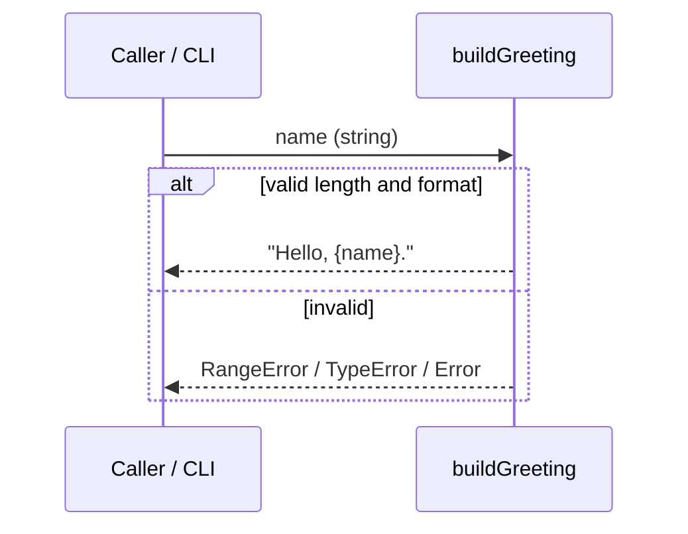

# Semi-Technical Walkthrough: personal-greeting

> For stakeholders who read specs and contracts but not implementation diffs. No diagrams that expose secret internals unless already in `feature.plan.md`.

## Executive summary

- **Intent:** Validate a user's display name (1..140 plain-text characters) and return a
  deterministic greeting string for display at login.
- **Scope:** Single module export `buildGreeting` in `src/greeting.js`; no HTTP layer or
  database in this test repo.
- **Contracts touched:** `contracts/example.md` — module contract `buildGreeting(name)`.

## Spec & plan alignment

| Capability | Plan deliverable | Status |
|---|---|---|
| C1. Save greeting (1..140 chars) | `buildGreeting(name)` accepts valid input | Aligned — validation at function boundary |
| C2. Display on login | Return value `Hello, ${name}.` | Aligned — caller/CLI displays return string |
| AC1.2 reject >140 | `RangeError` | Aligned — see contract failure table |

Open questions: none deferred; persistence explicitly out of scope for toy repo (documented
in `feature.plan.md` §5).

## Architecture & data

Entities from `data-model.md`:

| Entity | Role |
|---|---|
| GreetingInput.name | Caller-supplied string, 1..140 chars, single line |
| GreetingOutput.text | `"Hello, ${name}."` on success |
| GreetingBounds | Exported `GREETING_MIN` (1), `GREETING_MAX` (140) |

## Contracts

| Contract | Change | Backward compatible? | Consumer impact |
|---|---|---|---|
| `buildGreeting(name)` | New module export | Yes (additive) | Tests and CLI; no existing clients |
| `GREETING_MIN` / `GREETING_MAX` | New constants | Yes | Public bounds for integrators |

Failure mapping (see `contracts/example.md`):

| Condition | Outcome |
|---|---|
| length 1..140, single line | Success string |
| length 0 or >140 | `RangeError` |
| non-string | `TypeError` |
| contains newline | `Error` |

## Impact forecast vs reality

- **Predicted:** additive module surface, no migration — **held**.
- **Predicted:** low performance/security envelope change — **held** (pure function, no I/O).
- **Delta:** spec wording implies DB persistence; plan and reconciliation document stateless
  mapping for this test repo only.

## Risks & follow-ups

- Production deployment would need a persistence layer for true "save on login" — tracked
  as out of scope.
- Unicode/emoji not explicitly blocked beyond length — acceptable for Level 0 test repo.

## Approval

- [x] Semi-technical reviewer: Jane Tester, 2026-05-22
- Comments: Spec, plan, data model, and contract are coherent for the toy library shape.
